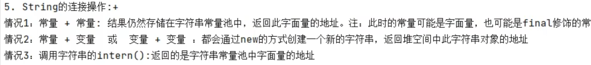
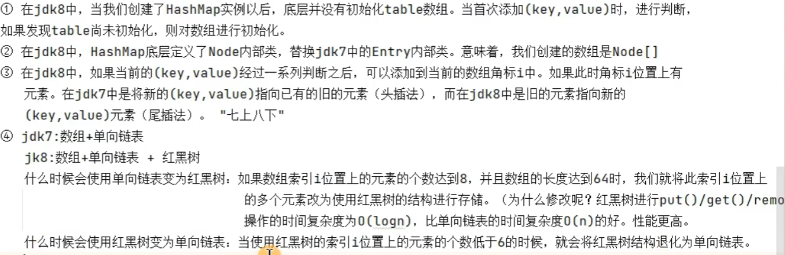
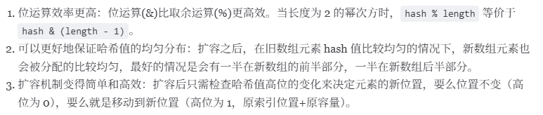
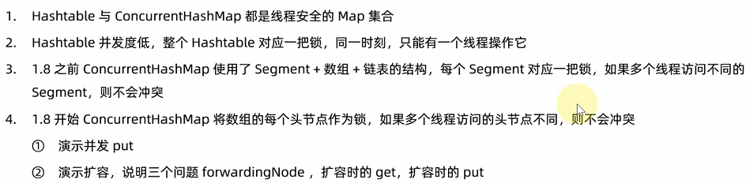
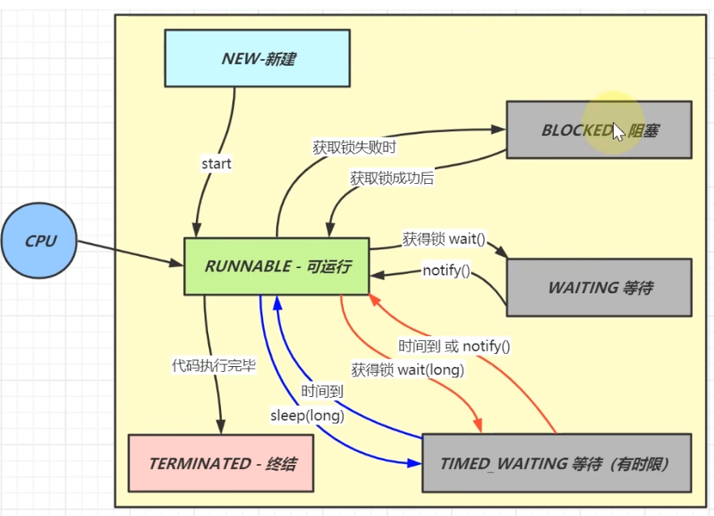
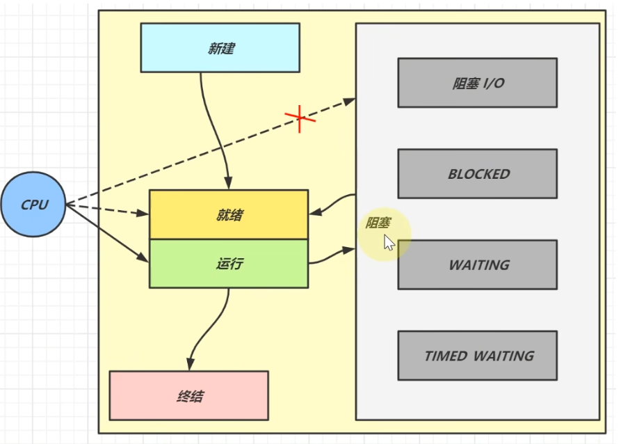
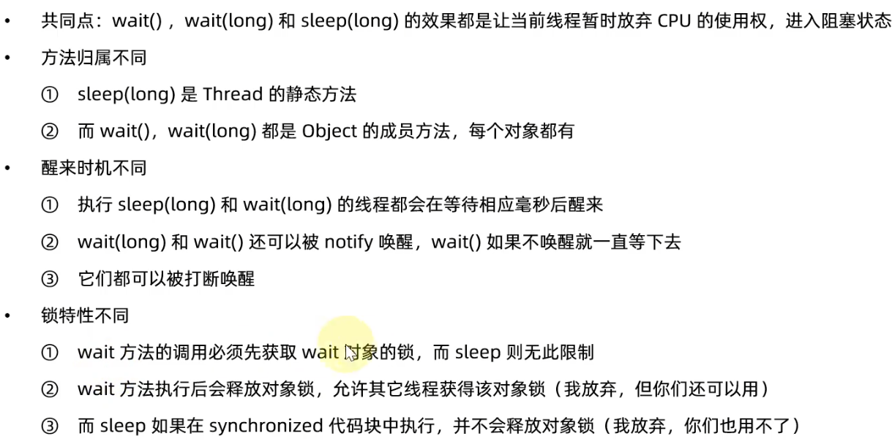
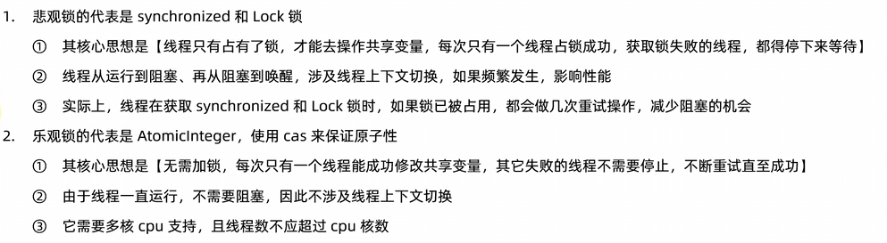
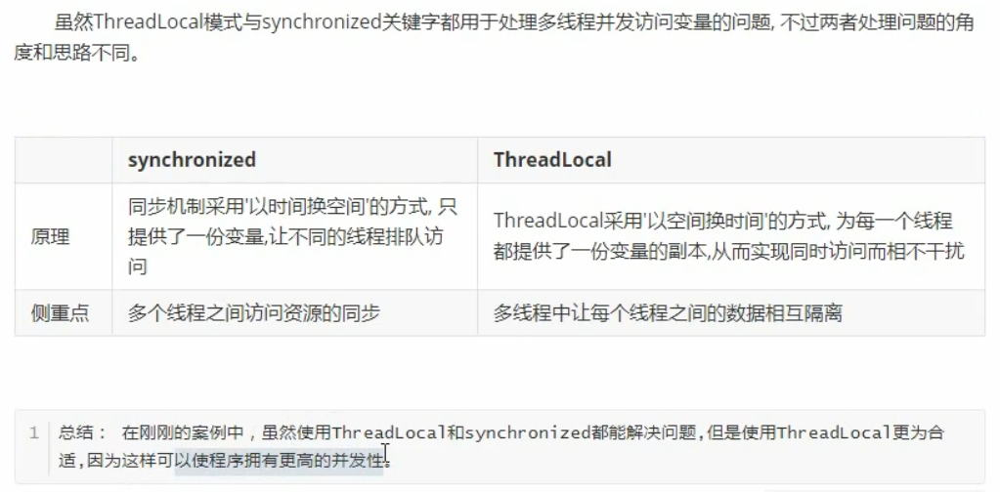
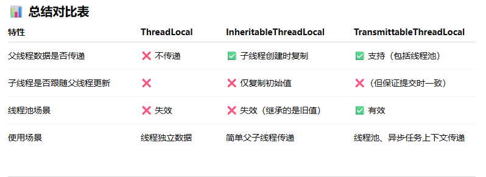

## String

+ `String` 不可被继承
+ `Serializable` 可序列化的接口。
+ `Comparable` 对象可比较

##### 1. 内部声明属性

`jdk8` :

```java
private final char[] value; // 存储字符串数据的容器
```

> `final` : 指明一旦初始化，其地址不可变；

`jdk9` :

```java
private final byte[] value; // 存储字符串数据的容器
```

##### 2. 字符串常量的存储位置

> 字符串常量都存储在字符串常量池中；
>
> 字符串常量池不允许存放两个相同的字符串常量；
>
> 字符串常量池，不同版本存放位置不同：
>
> + `jdk7` 放在方法区
> + `jdk7及以后` 放在堆空间
> + 原因是：考虑 `GC` ，堆空间频繁发生 `GC` ，而方法区(加载类的信息，一般回收不掉，`jdk8` **方法区开始使用物理内存**)相比较很少发生 `GC` ，如果将字符串常量池放在方法区，可能会导致常量池越来越大，很少被回收，**为了及时回收，放入堆空间**


##### 3. `String` 不可变性的理解

1. 对字符串变量重新赋值时，需要重新指定一个字符串常量的位置进行赋值，不能在原有位置修改
2. 对现有字符串进行拼接时，重新开辟空间保存拼接后的字符串
3. 使用 `replace` 方法替换某个字符，-> 实际开辟空间保存修改后的字符串





## 集合

### ArrayList

> 实现了List接口，存储有序、可重复数据
>
> 底层使用 `Obejct[]` 数组存储
>
> 线程不安全

jdk7 创建 List 时，初始化长度为 10 的数组；jdk8 在添加元素时创建长度为 10 的数组。

扩容操作：扩容大小为原来数组大小的 1.5倍


### Vector

> 实现了List接口，存储有序、可重复数据
>
> 底层使用 `Obejct[]` 数组存储
>
> 线程 **安全**

扩容操作：扩容大小为原来数组大小的 2倍

### LinkedList

> 实现了List接口，存储有序、可重复数据
>
> 底层使用 **双向链表** 数组存储
>
> 线程不安全


### HashMap

特点

> HashMap中的所有key彼此之间不可重复、无序的。所有key构成一个Set集合
>
> HashMap中的所有value彼此之间可重复、无序的。所有value构成一个Collection集合。
>
> HashMap中的一个key-value，构成一个entry。
>
> HashMap中的所有entry彼此之间是不可重复、无序的。所有entry构成一个Set集合。

#### 创建对象和添加数据

初始容量 16，每次扩容变为原来2倍。

#### jdk7

创建过程中，底层初始化数组 `Entry[] table = new Entry[16]` 

```java
HashMap<String, Integer> map = new HashMap<>();
```

添加和修改过程

将(key, value)添加到当前map中:

首先，调用key所在类的 `hashCode()` 方法，计算key对应的哈希值1，此哈希值1经过某种算法(hash())之后，得到哈希值2。哈希值2通过某种算法 `(indexFor())` 之后，确定添加元素(key, value) 在table中的索引位置i。

```java

```

1.1 判断数组索引 `i` 处不存在元素，则添加元素(key, value) 成功。

1.2 如果此索引位置 `i` 存在元素 (key1, value1)，则需要继续比较key和key1对应的哈希值2。

​		2.1 如果key的哈希值2与key1的哈希值2不相同，则添加元素(key, value) 成功。

​		2.2 如果key的哈希值2与key1的哈希值2相同，则继续判断比较key和key1的equals()。通过调用key所在类的equals()，将key1作为参数传递进去。

​				3.1 调用equals()，返回false：则添加元素(key, value) 成功。

​				3.2 调用equals()，返回true：则认为key和key2是相同的。默认情况下，value替换原有的value1。

随着元素添加，在满足一定条件下，选择扩容：

> 1.7是大于等于阈值(加载因子0.75)且没有空位时才扩容(插入的位置不为空)，1.8是大于阈值(加载因子0.75)直接扩容

```java
(size >= threshold) && (null != table[i])
```

元素个数达到临界值(数组长度*加载因子)，考虑扩容。默认临界值 = 16 * 0.75 = 12

默认扩容大小为原来的2倍。

#### jdk8

创建HashMap实力后，底层并未初始化table数组

 

```java
static final int hash(Object key) {
    int h;
    return (key == null) ? 0 : (h = key.hashCode()) ^ (h >>> 16);
}
```


HashMap的数组容量大小为什么是**2的次方**

为了HashMap存取高效并减少碰撞。

通过 `hash&(length - 1)` 得到元素存储位置，因为 `hash&(length - 1)` 与 `hash % length` 等价。前提是数组长度为2的次方。

通过扩容机制，对每个元素重新分配位置。HashMap扩容是之前**两倍**

+ 当原数组长度为 `N `, 扩容后数组长度为 `2N` 
+ 原位置计算是：`index = hash & (N - 1)`
+ 新位置计算是：`index = hash & (2N - 1)`

`(2N - 1)` 的二进制比 `(N - 1)` 多了一位低位的 1，也就是说：**新位置多判断了 hash 的“第 N 位”是否为 1**。


```java
do {
    next = e.next;
    // 原位置
    if ((e.hash & oldCap) == 0) {
        if (loTail == null)
            loHead = e;
        else
            loTail.next = e;
        loTail = e;
    }
    else {
    // 新位置= 原位置 + 原始数组容量大小
        if (hiTail == null)
            hiHead = e;
        else
            hiTail.next = e;
        hiTail = e;
    }
} while ((e = next) != null);
```


举例证明

`hash = 0b001010`（十进制 10）

```java
hash & (oldCap - 1) = 0b001010 & 0b01111 = 0b01010 = 10（旧位置）
hash & oldCap       = 0b001010 & 0b10000 = 0b00000 → 为 0
```

→ 留在原位置 `10`

再换个 ` hash = 0b101010`（十进制 42）

```java
hash & (oldCap - 1) = 0b101010 & 0b01111 = 0b001010 = 10（旧位置）
hash & oldCap       = 0b101010 & 0b10000 = 0b10000 → 非 0
```

→ 移动到新位置：`10 + 16 = 26`


总结 HashMap 的长度为2的次方原因



>追求效率选择2的n次幂，追求分布均匀性选择**质数**


### LinkedHashMap

LinkedHashMap是HashMap的子类，在HashMap使用的数组+单向链表+红黑树基础上，增加了双向链表，记录添加的(key, value)的先后顺序，方便遍历所有的key-value。

底层结构

```java
static class Entry<K,V> extends HashMap.Node<K,V> {
    Entry<K,V> before, after;
    Entry(int hash, K key, V value, Node<K,V> next) {
        super(hash, key, value, next);
    }
}
```


### ConcurrentHashMap(*)

#### jdk1.7 

+ 采用 **分段数组+HashEntry数组+链表** 实现
+  (饿汉式的初始化)
+ 超过了容量的3/4扩容，

线程安全：[看JavaGudie](https://javaguide.cn/java/collection/java-collection-questions-02.html#hashmap-%E5%B8%B8%E8%A7%81%E7%9A%84%E9%81%8D%E5%8E%86%E6%96%B9%E5%BC%8F)

jdk1.7: `ConcurrentHashMap` 的三个属性：`capacity` (数据总个数，每个 `Segment` 数组中的 `hashEntry` 数组的 `Entry` 总个数)，`factor` 加载因子，`clevel` 并发数(初始固定，之后不改变)。所以，`capacity/clevel=Segment` 数组中的 `hashEntry` 数组的 `Entry` 个数。

`Segment` 数组中存储的是 `HashEntry` 数组，


#### jdk1.8

+ 采用与 `HashMap` 的结构一致，**数组+链表/红黑树** 
+ 懒汉式的初始化
+ 数组中元素个数达到容量的3/4扩容(满容量的3/4，若初始修改了 `factor` 的大小，初始使用了factor后，之后factor都使用3/4)

+ `ConcurrentHashMap map = new ConcurrentHashMap()` 和 `ConcurrentHashMap map = new ConcurrentHashMap(16)` 
  + 不给初始值，默认16；给初始值，则判断16个元素给多少空间，32个；

### TreeMap


### HashTable

初始容量和扩容机制

不指定初始容量大小，按默认大小为11初始化；每次扩容变为原来的 `2n+1` 

线程安全

不太常用，采用ConcurrentHashMap



### Properties


### HashSet

特点：存储无序、不可重复的数据

|---- HashSet 实现类：底层使用 HashMap， 使用数组+单项链表+红黑树结构

​		|---- LinkedHashSet: HashSet的子类，在现有的数组+单项链表+红黑树结构的基础上，添加了一组双向链表，用户记录添加元素的先后顺序。即，可以按照添加元素的顺序实现遍历操作

​		|---- TreeSet: 底层使用红黑树存储。可以按照添加元素的指定的属性的大小顺序进行遍历。


##### 无序性和不可重复性理解

###### 无序性

根据添加元素的哈希值，计算其在数组中的存储位置，此位置不是依次排列，表现为无序性。

###### 不可重复性

比较标准：判断 hascode() 得到的值和 equals() 返回的布尔值，两个方法的结果。

哈希值相等且 `equals` 方法返回 为 `true` ，则认为元素相同。


## 线程

> Java线程状态，六种状态




> 操作系统层面的线程状态

1. 分到CPU时间的：运行
2. 可以分到CPU时间的：就绪
3. 分布到CPU时间的：阻塞



### Sleep vs Wait




使用位置：`sleep()` 可以在任意位置，`wait` 必须在同步块内(持有锁)


### Lock vs Synchronized


## Synchronized

[锁升级](https://www.cnblogs.com/star95/p/17542850.html)

打印奇偶数

```java
public class PrintOddEvenTest {

    private static final Object lock = new Object();
    private static int count = 1;
    private static int max = 100;

    public static void main(String[] args) {
        new Thread(() -> {
            synchronized (lock) {
                while (count <= max) {
                    if (count % 2 == 1) {
                        System.out.println(Thread.currentThread().getName() + "-当前奇数：" + count++);
                        lock.notify();
                    } else {
                        try {
                            lock.wait();
                        } catch (InterruptedException e) {
                            throw new RuntimeException(e);
                        }
                    }

                }
            }
        }, "t1").start();

        new Thread(() -> {
            synchronized (lock) {
                while (count <= max) {
                    if (count % 2 == 0) {
                        System.out.println(Thread.currentThread().getName() + "-当前偶数：" + count++);
                        lock.notify();
                    } else {
                        try {
                            lock.wait();
                        } catch (InterruptedException e) {
                            throw new RuntimeException(e);
                        }
                    }

                }
            }
        }, "t2").start();
    }
}
```


### Java中的悲观锁 VS 乐观锁




#### 悲观锁


#### 乐观锁


### AQS

[AQS原理](https://www.zhihu.com/question/392149524/answer/1959029126703876000)


## ThreadLocal

#### 1. 基本原理

+ 初始容量16，
+ 索引计算，在0的基础上加一个值得到 `hashcode` ，然后得到索引
+ 加载因子factor=2/3，
+ 扩容为原来数组的2倍
+ **开放寻址法** (线性探测法，**线性探测法**是**开放寻址法**的一种具体实现方式，二者是 “特殊” 与 “一般” 的关系，其他开放寻址法的实现：二次探测，双重哈希) 解决hash冲突(HashMap、ConcurrentHashMap和HashTable使用**拉链法**解决hash冲突)

> 1. ThreadLocal 实现资源对象的线程隔离，让每个线程各用各的的资源对象，避免争用引发的线程安全问题
> 2. ThreadLocal 同时实现了线程内的资源共享
> 3. 总结，实现了线程间的资源隔离，线程内的资源共享


[ThreadLocal详解](https://juejin.cn/post/7081803699617529886?share_token=55d98f35-5e5d-4aae-ae45-067eae1845c1) 

[黑马程序员Java基础教程由浅入深全面解析threadlocal_哔哩哔哩_bilibili](https://www.bilibili.com/video/BV1N741127FH/?share_source=copy_web&vd_source=f53af8c9157589f9aac8ed85ad47fba5)


#### 2. 内存泄漏

##### 1. 假设 `ThreadLocalMap` 中的 `Key` 使用了强引用，那么会出现内存泄漏吗？

1. 假设在业务代码中使用完 `ThreadLocal` ，`threadLocal Ref` 被回收。

2. 但是因为threadLocalMap 的Entry 强引用了threadLocal，造成threadLocal无法被回收。
2. 在没有手动删除这个Entry以及CurrentThread依然运行的前提下，始终有强引用链threadRef->currentThread->threadLocalMap->entry，Entry就不会被回收(Entry中包括了ThreadLocal实例和value)，导致Entry内存泄漏

也就是，`ThreadLocalMap` 中的key使用了强引用，是无法完全臂弯内存泄漏的。


#####  2. 假设 `ThreadLocalMap` 中的 `Key` 使用了弱引用，那么会出现内存泄漏吗？


##### 3. 出现内存泄露的真实原因


> 根本原因：
>
> + `ThreadLocalMap`  的生命周期跟 `Thread` 一样长，如果没有手动删除对应的 `key` 就会导致内存泄漏。

##### 4. 为什么使用弱引用

`ThreadLocalMap` 中的 `key` 使用强引用或者弱引用与内存泄漏是没有关系。

要避免内存泄露的两种方式：

+ 使用完 `ThreadLocal` ，调用其 `remove()` 方法删除对应的 `Entry` ;
+ 使用完 `ThreadLocal` ，当前的 `Thread` 也随之运行接收


综上，**使用完 `ThreadLocal` ，`currentThread` 依然运行的前提下，就算忘记调用 `removed()` 方法，弱引用比强引用可以多一层保障：弱引用的 `ThreadLocal` 会被回收，对应的 `value` 在下一次 `ThreadLocalMap` 调用 `set` 、`get`、`remove` 中的任意一个方法都会被清除，从而避免内存泄漏。** 


#### 3. 简单代码实现

引入 `Mysql驱动` 依赖

```java
<dependency>
    <groupId>mysql</groupId>
    <artifactId>mysql-connector-java</artifactId>
    <version>8.0.29</version>
</dependency>
```


**实现线程间资源隔离** 

```java
public class ThreadLocalTest {

    public static void main(String[] args) {
        test2();
    }

    public static void test2() {
        for (int i = 0; i < 5; i++) {
            new Thread(() -> {
                System.out.println(Utils.getConnection());
            }, "t" + i).start();
            
        }
    }

    static class Utils {
        private static final ThreadLocal<Connection> t = new ThreadLocal<>();

        public static Connection getConnection() {
            Connection connection = t.get();
            if (connection == null) {
                connection = innerGetConnection();
                t.set(connection);
            }
            return connection;
        }

        private static Connection innerGetConnection() {

            try {
                return DriverManager.getConnection("jdbc:mysql://localhost:3306/tlias?useSSL=false", "root", "123456");
            } catch (Exception e) {
                throw new RuntimeException(e);
            }

        }
    }
}
```

#### 4. 优势


#### 5. 比较

##### ThreadLocal vs Synchronized



##### ThreadLocal vs InheritableThreadLocal vs TransmittableThreadLocal

1. `ThreadLocal`
   + **定义**：每个线程都维护一个独立的副本，线程之间互不影响。(**实现线程之间的资源隔离**) 
   + **特点**：
     + 父线程中的值不会传递给子线程。
     + 适合保存线程级别的上下文数据（比如用户会话、数据库连接等）。
   + **使用场景**
     + 每个线程需要独立变量，不希望共享时
2. `InheritableThreadLocal` 
   + **定义**：继承自 `ThreadLocal`，它可以让**子线程**在创建时“继承”父线程中的值。
   + **特点**
     + 子线程启动时，会拷贝父线程的值。
     + **但不会跟随父线程后续修改而更新**（拷贝的是快照）。
     + 线程池场景下不可靠，因为线程复用，可能继承的是旧值。
   + **使用场景**
     - 一次性子线程场景（非线程池），需要在子线程初始化时拿到父线程上下文。
3. `TransmittableThreadLocal` **(TTL)**
   + **定义**：阿里开源的扩展库（`com.alibaba.ttl.TransmittableThreadLocal`），解决了 `InheritableThreadLocal` 在**线程池**中失效的问题。
   + **特点**
     + 支持在线程池复用场景下 **上下文值的传递**。
     + 值的传递是通过**任务包装器（`TtlRunnable` / `TtlCallable`）**，在任务提交时捕获父线程的上下文，在任务执行时恢复。
     + 执行完后会清理，避免“脏数据”。
   + **使用场景**
     - 线程池、异步执行框架中需要上下文传递，比如：分布式调用链追踪、日志链路ID传递。





