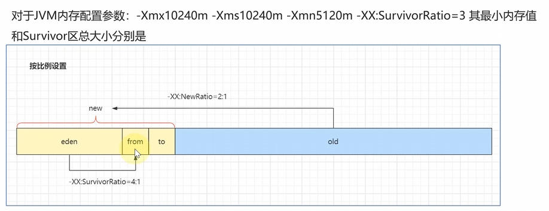
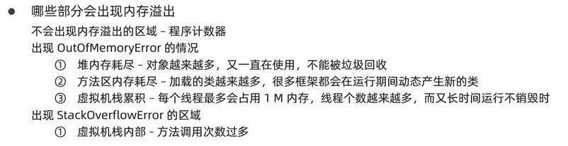
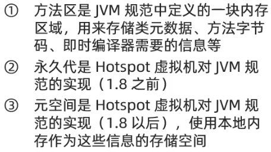
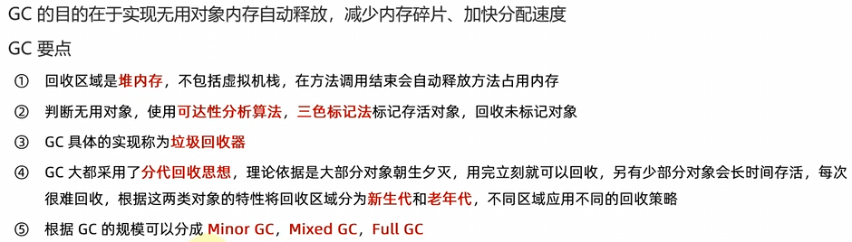
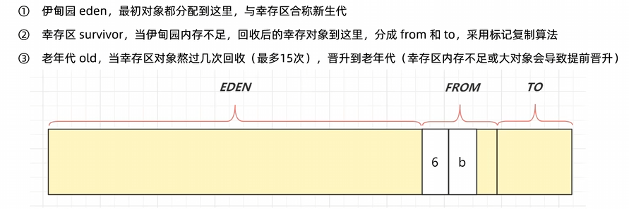
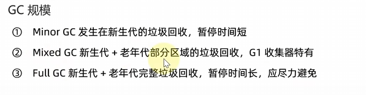
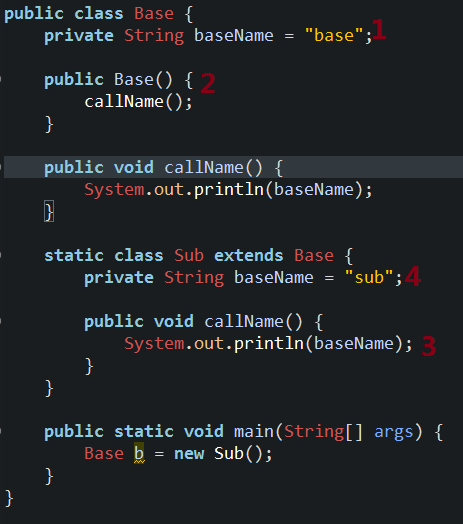

# JVM


### JVM参数



`-Xmx10240` :  JVM最大内存

`-Xms10240` :  JVM最小内存

`-Xmn10240` :  新生代大小

`-XX: SurvivorRatio=3` : 幸存者区的from与eden(伊甸园区)的内存占比   (默认为8: 1)

`-XX: NewRatio=2:1` : 新生代和老年代 (默认2:1)


 

### JVM运行时出现内存溢出



## 方法区与永久代、元空间



### GC和分代回收算法




#### 分代回收



#### GC



## 类的初始化和类的加载

### 对象创建过程

[一文搞懂java对象创建过程 - 知乎](https://zhuanlan.zhihu.com/p/240458901)

[Java虚拟机面试题 | 小林coding | Java面试学习](https://xiaolincoding.com/interview/jvm.html#创建对象的过程)

可以分为 **编译期** 和 **运行期** 两部分来看：

#### 1. 编译期准备

```java
User user = new User();
```

编译器会：

1. **检查类是否已加载、连接和初始化**（通过类加载器）。
   - 类加载：把 `User.class` 字节码加载进方法区（元空间/PermGen）。
   - 验证：校验字节码合法性。
   - 准备：为静态变量分配内存并赋默认值。
   - 解析：符号引用替换为直接引用。
   - 初始化：执行 `<clinit>()` 静态代码块和静态变量赋值。

#### 2. 运行期对象创建过程

执行 `new User()` 时，大致分为以下步骤：

##### (1) 类加载检查

Java虚拟机遇到一条new字节码指令时，首先将去检查这个指令的参数是否能在常量池中定位到一个类的符号引用，并且检查这个符号引用对应的类是否已经被**加载，链接和初始化过**。

- 如果没有，就先触发类加载过程。

##### (2) 分配内存

- JVM 在 **堆内存** 中为对象分配所需的内存空间（大小由类的实例字段决定，不包括静态字段）。
- 分配方式常见有两种：
  - **指针碰撞 (Bump-the-pointer)**：堆内存规整时，通过移动指针一次性分配。未被使用和已被使用堆内存分开来放置在两侧，中间通过一个指针来作为分界的指示器，分配内存时只需将分界指针往未使用内存空间移动出对象所需空间即可。
  - **空闲列表 (Free List)**：堆内存不规整时，从空闲块中找一块合适的分配。虚拟机维护一个列表来记录哪些内存空间是未使用的，分配时在列表中找一个足够大的空间划分给该对象。

> 使用哪种方式取决于垃圾收集器（GC）算法。

##### (3) 内存初始化

- JVM 会先把分配的对象空间初始化为 **默认值**（0、false、null 等），保证实例字段在使用前有默认值。

##### (4) 设置对象头

对象头（Object Header）中保存：

- **类元数据指针**（指向类在方法区的元数据，表明对象属于哪个类）。
- **哈希码、GC 分代年龄、锁标志位**等信息。

##### (5) 执行 `<init>()` 构造方法

- 执行对象的 **实例变量初始化**（代码里的显式赋值）。
- 执行 **构造函数** 的逻辑。
- 如果有父类，会先递归调用父类构造函数。

##### (6) 返回对象引用

- `new` 表达式最终返回对象的引用，存放在栈帧的局部变量表中（也就是 `user` 这个引用变量）。

#### 3. 对象创建过程总结

一句话概括就是：

**类加载检查 → 内存分配 → 默认零值初始化 → 设置对象头 → 执行构造函数 → 返回引用**

#### 举例

```java
class User {
    static int counter = 100; // 静态变量
    int id = 1;               // 实例变量
    String name = "guest";    // 实例变量

    User() {
        System.out.println("构造函数执行");
    }
}

public class Main {
    public static void main(String[] args) {
        User u1 = new User();
        User u2 = new User();
    }
}

```


##### 执行过程分析

###### 1. **类加载阶段**

当第一次用到 `User` 类时（这里是 `new User()`），JVM 会做类加载：

- **加载**：把 `User.class` 读进内存。
- **验证**：检查字节码合法。
- **准备**：为静态变量 `counter` 分配内存，并赋**默认值** `0`。
- **初始化**：执行静态变量赋值 → `counter = 100`。
   这一步只执行 **一次**。

> 此时：
>
> - 方法区（元空间）里有 `User` 的类信息。
> - 静态变量 `counter = 100` 已经存在方法区。

###### 2. **创建对象 u1 = new User()**

- **堆内存分配**：分配 `User` 对象实例空间。
- **默认初始化**：`id = 0, name = null`。
- **设置对象头**。
- **实例变量赋值**：`id = 1, name = "guest"`。
- **执行构造函数**：打印 `构造函数执行`。
- 返回堆中对象引用，赋给栈上的变量 `u1`。

###### 3. **创建对象 u2 = new User()**

- 类已经加载过，**静态变量不会再初始化**。
- 在堆上再分配一个新对象，过程同上。
- 静态变量 `counter` 仍然是类共享的，值还是 `100`。

##### 内存布局对比

```java
方法区（元空间）
 └── User 类信息
      └── static counter = 100   // 所有对象共享

堆
 ├── u1对象
 │     ├── id = 1
 │     └── name = "guest"
 └── u2对象
       ├── id = 1
       └── name = "guest"

栈（main线程栈帧）
 ├── u1 → 引用堆中对象1
 └── u2 → 引用堆中对象2
```


### 类的加载过程

#### 举例 1

```java
public class Base {
    private String baseName = "base";

    public Base() {
        callName();
    }

    public void callName() {
        System.out.println(baseName);
    }

    static class Sub extends Base {
        private String baseName = "sub";

        public void callName() {
            System.out.println(baseName);	// Null
        }
    }

    public static void main(String[] args) {
        Base b = new Sub();
    }
}
```


1.首先，需要明白**类的加载顺序**。 

  (1) 父类静态代码块(包括静态初始化块，静态属性，但不包括静态方法) 

  (2) 子类静态代码块(包括静态初始化块，静态属性，但不包括静态方法  )

   (3) 父类非静态代码块(  包括非静态初始化块，非静态属性  )

   (4) 父类构造函数

   (5) 子类非静态代码块  (  包括非静态初始化块，非静态属性  )

   (6) 子类构造函数

其中：类中静态块按照声明顺序执行，并且(1)和(2)不需要调用new类实例的时候就执行了(意思就是在类加载到方法区的时候执行的) Base b = new Sub(); **它为多态的一种表现形式，声明是Base,实现是Sub类，**  **理解为 b 编译时表现为Base类特性，运行时表现为Sub类特性。** 当子类覆盖了父类的方法后，意思是父类的方法已经被重写，**题中父类初始化调用的方法为子类实现的方法，子类实现的方法中调用的baseName为子类中的私有属性。**  由1.可知，此时只执行到步骤4.子类非静态代码块和初始化步骤还没有到，子类中的baseName还没有被初始化。所以此时  baseName为空。  所以为null。




举例 2

```java
public class Father {
    private int i = test();
    private static int j = method();

    static {
        System.out.print("1 ");
    }

    Father() {
        System.out.print("2 ");
    }

    {
        System.out.print("3 ");
    }

    public int test() {
        System.out.print("4 ");
        return 1;
    }

    public static int method() {
        System.out.print("5 ");
        return 1;
    }
}


class Son extends Father {
    private int i = test();
    private static int j = method();

    static {
        System.out.print("6 ");
    }

    Son() {
        System.out.print("7 ");
    }

    {
        System.out.print("8 ");
    }

    public int test() {
        System.out.print("9 ");
        return 1;
    }

    public static int method() {
        System.out.print("10 ");
        return 1;
    }

    public static void main(String[] args) {
        Son s1 = new Son();
        System.out.println();
        Son s2 = new Son();
    }
}
```

```java
5 1 10 6 9 3 2 9 8 7 
9 3 2 9 8 7 
```

子类重写了父类的 `test` 方法，所以父类执行非静态代码块(非静态初始块，非静态属性) 时调用的是子类的 `test` 方法，输出 `9` 。

如果未重写父类的 `test` 方法，则父类调用自己的 `test` 方法， 顺序为

```java
5 1 10 6 4 3 2 9 8 7 
9 3 2 9 8 7 
```


