# Spring

#### 核心概念

##### IoC 控制反转

使用对象时，由主动new产生对象转换为由外部提供对象，此过程中对象的创建控制权由程序转移到外部，此思想为控制反转。

`Spring` 技术对IoC思想进行了实现

+ `spring` 提供了一个容器，称之为 `Ioc` 容器，用来充当 `IoC` 思想中的外部。
+ `IoC` 容器负责对象的创建、初始化等一系列工作，被创建或被管理的对象在 `IoC` 容器中统称为Bean。

`DI` 依赖注入

+ 在容器中建立 `bean` 与 `bean` 之间的依赖关系的整个过程，称之为依赖注入。


#### BeanFactory & ApplicationContext


`ApplicationContext` 的继承体系，只在Spring基础环境下，常用的三个 `ApplicationContext` 作用如下：

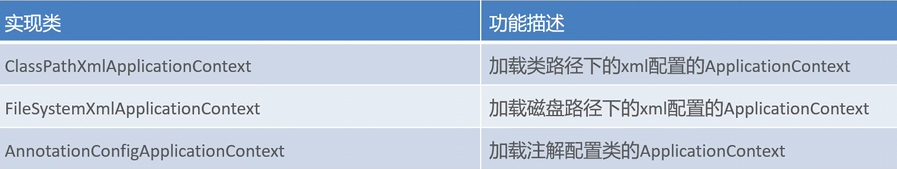


## IoC的入门案例

### 思路分析

1. 管理什么？（Dao、Service）
2. 如何将被管理的对象告知给IoC容器？(配置)
3. 被管理的对象交给IoC容器，如何若去IoC容器？(接口)
4. IoC容器获取后，如何从容器中获取bean？(接口方法)
5. 使用Spring导入哪些坐标？(pom.xml)

### 步骤

1. 导入`maven` 坐标

```java
<dependency>
      <groupId>org.springframework</groupId>
      <artifactId>spring-context</artifactId>
      <version>5.2.10.RELEASE</version>
</dependency>
```

2. 定义 `Spring` 管理的类(接口)

```java
public interface BookService{
    public void save();
}
```

```java
public class BookServiceImpl implement BookService{
    private BookDao bookDao = new BookDaoImpl();
    
    public void save(){
        System.out.println("bookService...");
        bookDao.save();
    }
}
```

3. 创建 `Spring` 的配置文件，配置对应的类作为 `Spring` 管理的bean

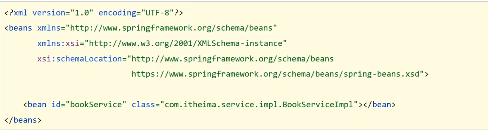

```xml
<!--配置bean>
id属性表示给bean起名字
class属性表示给bean定义类型
```

+ bean定义时id属性在同一个上下文中不能重复

4. 初始化IoC容器(Spring核心容器/Spring容器)，通过容器获取bean

```java
public classs App{
    public static void main(String[] args) {
        
        // 加载配置文件得到上下文对象，也就是容器对象
        ApplicationContext ctx = new ClassPathXmlApplicationContext("applicationContext.xml");
        
        // 获取资源
        BookService bookService = (BookSerivce) ctx.getBean("bookService");
        bookService.save();
    }
}
```

## DI入门案例

1. 基于IoC容器管理Bean
2. Service中使用new 形式创建对象的 `Dao` 对象是否保留？(否)
3. Service中需要的 `Dao` 对象如何进入到 `Service` ？(提供方法)
4. Service与Dao之间的关系如何描述？(配置)

```xml
<?xml version="1.0" encoding="UTF-8"?>
<beans xmlns="http://www.springframework.org/schema/beans"
       xmlns:xsi="http://www.w3.org/2001/XMLSchema-instance"
       xsi:schemaLocation="http://www.springframework.org/schema/beans http://www.springframework.org/schema/beans/spring-beans.xsd">
    <!--    1.导入spring的坐标spring-context对应版本是5.2.10.RELEASE-->
    <!--    2.配置bean-->
    <bean id="bookDao" class="com.itheima.dao.impl.BookDaoImpl"></bean>
    <bean id="bookService" class="com.itheima.service.Impl.BookServiceImpl">
        <property name="bookDao" ref="bookDao"/>
    </bean>
</beans>
```

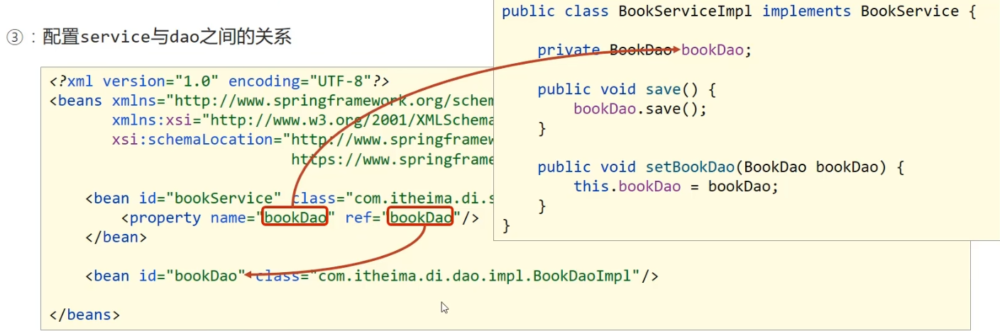

```java
public class BookServiceImpl implement BookService{
    
    // 删除业务层使用new创建的Dao对象
    private BookDao bookDao;
    
    public void save(){
        System.out.println("bookService...");
        bookDao.save();
    }
    
    // 需要提供对应的set方法
    public void setBookDao(BookDao bookDao) {
        this.bookDao = bookDao;
    }
}
```

## bean配置

### 别名配置

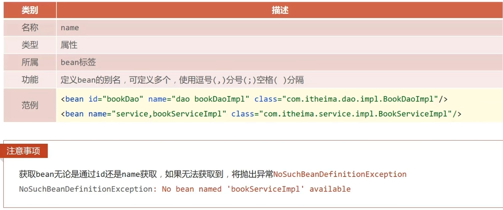

### bean作用范围配置

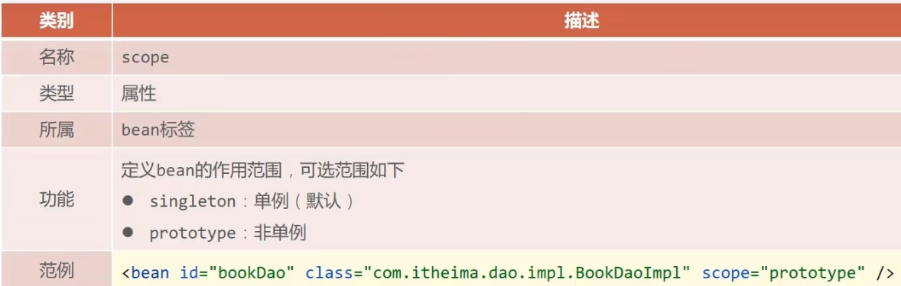

```xml
<bean id="bookDao" class="com.itheima.dao.impl.BookDaoImpl" scope="singleton"></bean>
```

### 为什么bean默认为单例？

+ 适合交给容器进行管理的bean
  + 表现层对象
  + 业务层对象
  + 数据层对象
  + 工具对象
+ 不适合交给容器管理的bean
  + 封装实体的域对象

## bean实例化

### 1. 构造方法实例化

+ 提供可访问的构造方法

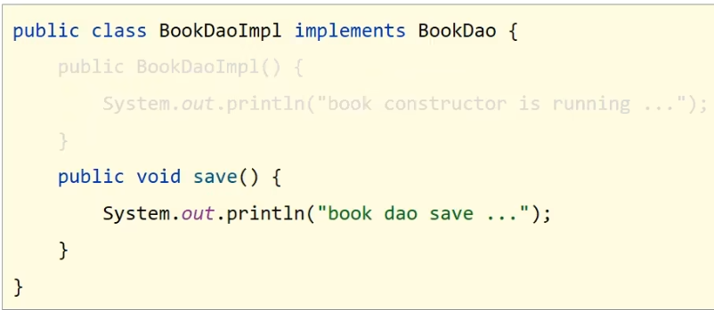

+ 配置

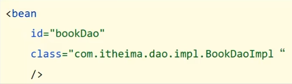

+ 无参构造方法不存在时，将抛出异常 `BeanCreationException`

### 2. 静态工厂(了解)

+ 静态工厂

```java
<bean id="orderDao" class = "com.kaiming.factory.OrderDaoFactory" fatory-method="getOrderDao"></bean>
```

```java
public class OrderDaoFactory{
    public static OrderDao getOrderDao() {
        return new OrderDaoImpl();
    }
}
```

+ 配置

```xml
<bean id="orderDao" factory-method="getOrderDao" class="com.itheima.factory.OrderDaoFactory"></bean>
```

### 3.  实例工厂初始化bean(了解)

+ 实例工厂


```java
<bean id="myBeanFactory2" class="com.kaiming.factory.myBeanFactory2"></bean>
<bean id="userDao2" factory-bean="myBeanFactory2" factory-method="userDao"></bean>
```


```java
public class UserDaoFactory{
    
    public UserDao getUserDao() {
        return new UserDaoImpl();
    }
}
```

+ 配置

```xml
<!-- 1.配置工厂bean-->
<!-- 2.配置实例bean-->
<bean id="userFactory" class="com.itheima.factory.UserDaoFactory"/>
<bean id="userDao" factory-method="getUserDao" factory-bean="userFactory"/>
```

### 4.  使用 `FactoryBean` 实例化

+ `FactoryBean`


```java
<bean id="userDao3" class="com.kaiming.factory.UserDaoFactoryBean"></bean>
```


```java
public class UserDaoFactoryBean implements FactoryBean<UserDao>{
    
    @Override
    public UserDao getObject() throws Exception{
        return new UserDaoImpl();
    }
    
    public Class<?> getObjectTyep() {
        return UserDao.class;
    }
    
}
```

+ 配置

```xml
<bean id="UserDao" class="com.itheima.factory.UserDaoFactoryBean"></bean>
```

## bean生命周期(了解)


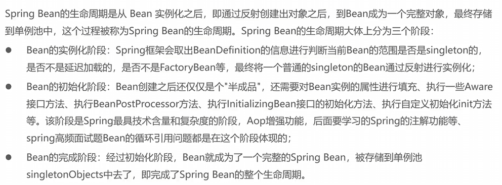


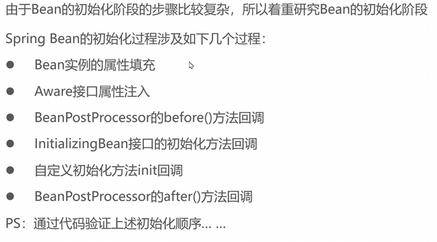


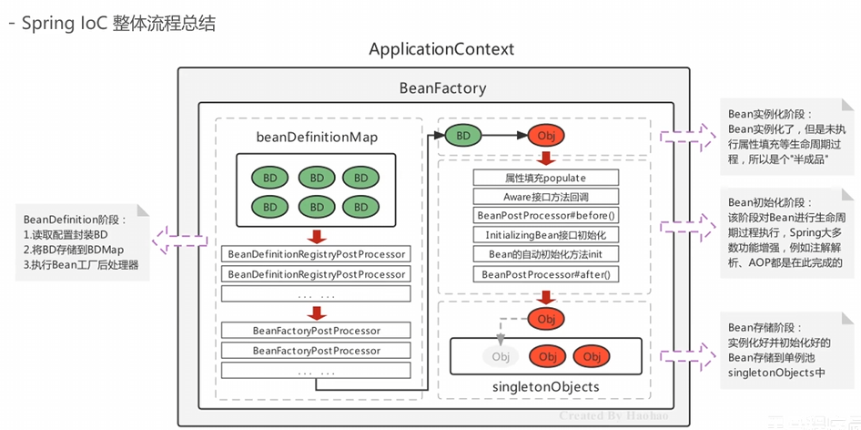


+ 生命周期：从创建到销毁的整个过程
+ bean的生命周期：bean从创建到销毁的整个完整过程
+ bean生命周期的控制：bean创建后到销毁前做的事情

### 1. 配置方法

+ 配置bean的生命周期控制方法

```xml
<bean id="bookDao" class="com.itheima.dao.impl.BookDaoImpl" init-method="init" destroy-method="destory"/>
```

+ 提供生命周期控制方法

```java
public class BookDaoImpl implements BookDao{
    
    public void save() {
        System.out.println("bookdao save...");
    }
    
    public void init() {
        System.out.println("init...");
    }
    
    public void destory() {
        System.out.println("destory...");
    }
    
}
```

### 2. 使用接口(了解)

+ 实现 `InitializatingBean` ，`DisposableBean` 接口

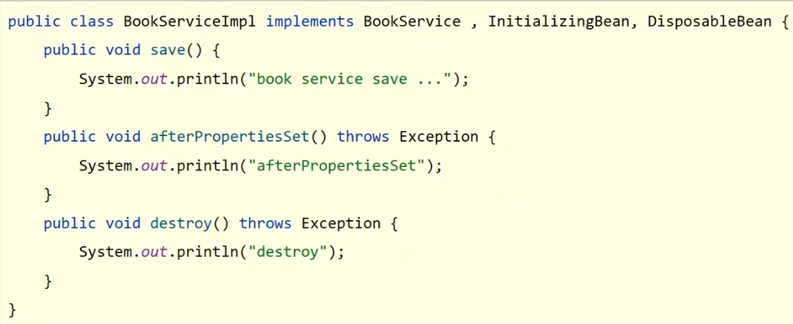

### bean初始化经历的阶段

+ 初始化容器
  + 创建对象(内存分配)
  + 执行构造方法
  + 执行属性注入(set方法)
  + **执行bean初始化方法**
+ 使用bean
  + 执行业务操作
+ 关闭/销毁容器
  + **执行bean销毁方法**

### bean销毁时机

+ 容器关闭前触发bean的销毁
+ 关闭容器的方法
  + 手工关闭容器
    + `ConfigurableApplicationContext` 接口的 `close` 方法
  + 注册关闭钩子，在虚拟机退出前先关闭容器再退出虚拟机
    + `ConfigurableApplicationContext` 接口 `registerShutdownHook` 操作

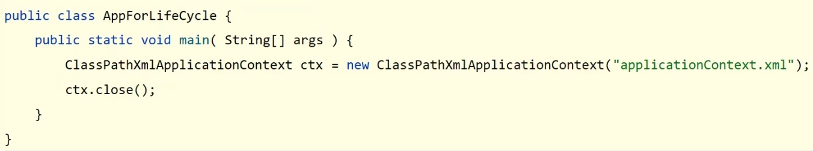


### Spring三级缓存设计


## 依赖注入

+ 思考：像一个类中传递数据的方法有几种？
  + 普通方法(set方法)
  + 构造方法
+ 思考：依赖注入描述在容器中建立bean与bean之间依赖关系的过程，如果bean运行需要的是字符串或者(数字)基本数据类型呢？
  + 引用类型
  + 简单类型(基本数据据类型与 `String`)

+ 依赖注入的方式
  + setter注入
    + 简单类型
    + 引用类型
  + 构造器注入
    + 简单类型
    + 引用类型

### 1. setter注入

#### 1.1 引用类型

+ 在bean中定义**引用类型属性**并提供可访问的set方法

```java
public class BookServiceImpl implements BookService {
    
    private BookDao bookDao;
    
    public void setBookDao(BookDao bookDao) {
        this.bookDao = bookDao;
    }
}
```

+ 配置中使用Property标签ref属性注入**引用数据类型**的对象

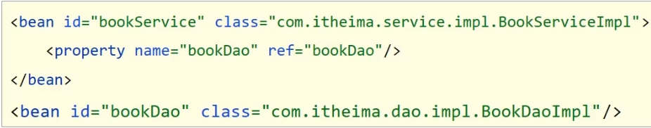

#### 1.2 简单类型

+ 在bean中定**义简单类型**属性并提供可访问的set方法

```java
public class BookServiceImpl implements BookService {
    
    private int connectionNumber;
    
    public void setConnectionNumber(int connectionNumber) {
        this.connectionNumber = connectionNumber;
    }
}
```

+ 配置中使用Property标签**value**属性注入简单数据类型

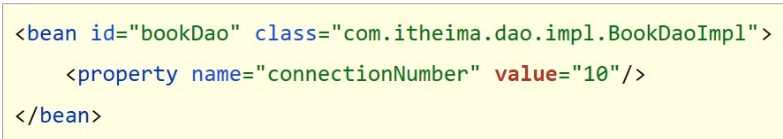

### 2. 构造方法注入

#### 2.1 引用类型

+ 在bean中定义**引用数据类型**属性并提供可访问的**构造方法**

```java
public class BookServiceImpl implements BookService {
    
    private BookDao bookDao;
    
    public void BookSerivceImpl(BookDao bookDao) {
        this.bookDao = bookDao;
    }
}
```

+ 配置中使用 `Constructor-arg` 标签 `ref` 属性注入引用类型对象

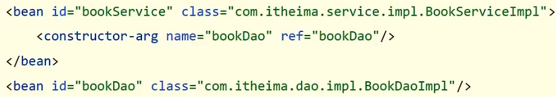

#### 2.2 简单类型

+ 在bean中定义简单类型属性并提供可访问的set方法

```java
public class BookServiceImpl implements BookService {
    
    private int connectionNumber;
    
    public BookServiceImpl(int connectionNumber) {
        this.connectionNumber = connectionNumber;
    }
}
```

+ 配置中使用 `Constructor-arg` 标签**value**属性注入简单数据类型

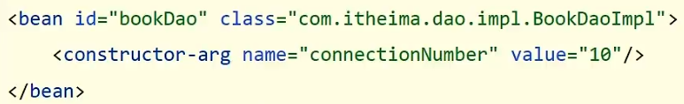

### 依赖注入方式选择

1. 强制依赖使用构造器，使用setter注入有概率不进行注入导致null对象出现；
2. 可选依赖使用setter注入进行，灵活性强；
3. Spring框架倡导使用构造器注入，第三方框架内部大多采用构造器注入的形式进行数据初始化，相对严谨；
4. 如果有必要可以两者同时使用，使用构造器注入完成强制依赖注入，使用setter注入完成可选依赖的注入；
5. 实际开发中根据实际情况分析，如果受控对象未提供setter方法，则使用构造器注入；
6. 自己开发的模块推荐使用setter注入

### 依赖自动装配

+ IoC容器根据bean所依赖的资源在容器中自动查找并注入到bean中的过程称之为**自动装配** 。

#### 1. 自动装配的方式

+ 按类型
+ 按名称
+ 按构造方法

配置中使用bean标签 `autowire` 属性设置自动装配的类型

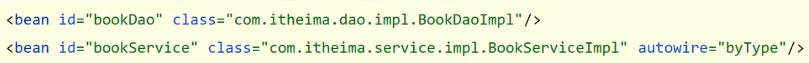

#### 2. 注意(依赖自动装配特征)

+ 自动装配用于引用类型依赖注入，不能对简单类型进行操作；
+ 使用按类型装配时(byType)必须保障容器中相同类型的bean唯一，推荐使用；
+ 使用按名称装配时(byName)必须保障容器中具有指定名称的bean，因变量名与配置耦合，不推荐；
+ 自动装配优先级低于setter注入和构造器注入，同时出现时自动装配配置失效；

### 集合注入(了解)

+ 注入数组对象

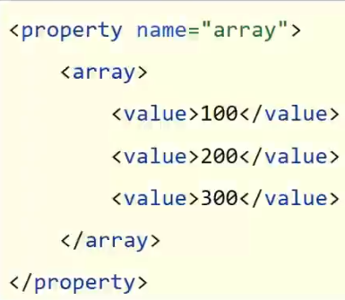

+ 输入List对象

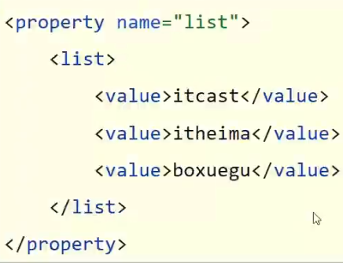

+ 输入set对象

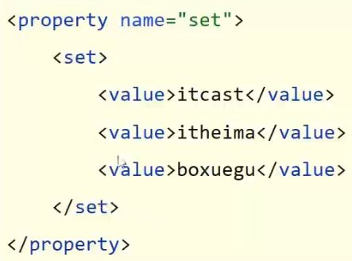

+ 注入map对象

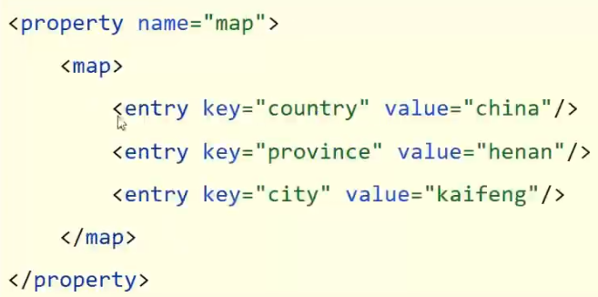

+ 注入property

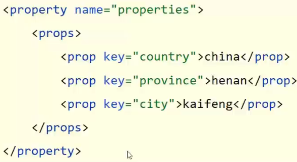


## 加载properties文件

#### 1. 加载properties配置文件信息

```properties
jdbc.driver=com.mysql.cj.jdbc.Driver
jdbc.url=jdbc:mysql://localhost:3306/table_account
jdbc.username=root
jdbc.password=123456
```


#### 2. 开启命名空间方式

```xml
<?xml version="1.0" encoding="UTF-8"?>
<beans xmlns="http://www.springframework.org/schema/beans"
       xmlns:xsi="http://www.w3.org/2001/XMLSchema-instance"
       xmlns:context="http://www.springframework.org/schema/context"

       xsi:schemaLocation="http://www.springframework.org/schema/beans
       http://www.springframework.org/schema/beans/spring-beans.xsd
        http://www.springframework.org/schema/context
        http://www.springframework.org/schema/context/spring-context.xsd
">
    <!--    加载properties文件-->
    <context:property-placeholder location="classpath:jdbc.properties"></context:property-placeholder>
    <!--    配置数据源信息-->
    <bean id="dataSource" class="com.alibaba.druid.pool.DruidDataSource">
        <property name="driverClassName" value="${jdbc.driver}"></property>
        <property name="url" value="${jdbc.url}"></property>
        <property name="username" value="${jdbc.username}"></property>
        <property name="password" value="${jdbc.password}"></property>
</beans>
```


## Spring配置非自定义Bean

### 1.DruidDataSource

xml配置

```java
<bean id="dataSource" class="com.alibaba.druid.pool.DruidDataSource">
    <property name="driverClassName" value="com.mysql.cj.jdbc.Driver"></property>
    <property name="url" value="jdbc:mysql://localhost:3306/atguigu"></property>
    <property name="username" value="root"></property>
    <property name="password" value="123456"></property>
</bean>
```

```java
public static void main(String[] args) {
    ApplicationContext api = new ClassPathXmlApplicationContext("beans.xml");
    DataSource dataSource1 = (DataSource) api.getBean("dataSource");
    System.out.println(dataSource1);
}
```

### 2. Connection

xml配置

```java
<bean id="connection" class="java.sql.DriverManager" factory-method="getConnection" scope="prototype">
    <constructor-arg name="url" value="jdbc:mysql://localhost:3306/tlias"></constructor-arg>
    <constructor-arg name="user" value="root"></constructor-arg>
    <constructor-arg name="password" value="123456"></constructor-arg>
</bean>
```


```java
public class ApplicationContextTest {

    public static void main(String[] args) throws SQLException {
        ApplicationContext api = new ClassPathXmlApplicationContext("beans.xml");
        DataSource dataSource1 = (DataSource) api.getBean("dataSource");
        System.out.println(dataSource1);

        Object connection = api.getBean("connection");
        System.out.println(connection);
    }
}
```


### 3. Date

xml配置

```java
<bean id="simpleDateFormat" class="java.text.SimpleDateFormat">
    <constructor-arg name="pattern" value="yyyy-MM-dd HH:mm:ss"></constructor-arg>
</bean>

<bean factory-bean="simpleDateFormat" factory-method="parse">
    <constructor-arg name="source" value="2025-09-08 17:58:00"></constructor-arg>
</bean>
```


```java
public class ApplicationContextTest {

    public static void main(String[] args) throws SQLException {
        ApplicationContext api = new ClassPathXmlApplicationContext("beans.xml");

        Object simpleDateFormat = api.getBean("simpleDateFormat");
        System.out.println(simpleDateFormat);
    }
}
```


### 4. SqlSessionFatory

xml配置

```java
<bean id="in" class="org.apache.ibatis.io.Resources" factory-method="getResourceAsStream">
    <constructor-arg name="resource" value="mybatis-config.xml"></constructor-arg>
</bean>
    
<bean id="builder" class="org.apache.ibatis.session.SqlSessionFactoryBuilder" ></bean>

<bean id="sqlSessionFactory" factory-bean="builder" factory-method="build">
    <constructor-arg name="inputStream" ref="in"></constructor-arg>
</bean>
```


```java
public class ApplicationContextTest {

    public static void main(String[] args) throws SQLException, IOException {
        ApplicationContext api = new ClassPathXmlApplicationContext("beans.xml");
		
          // 静态工厂
//        InputStream in = Resources.getResourceAsStream("mybatis-config.xml");
//        // 无参构造
//        SqlSessionFactoryBuilder builder = new SqlSessionFactoryBuilder();
//        // 实例工厂
//        SqlSessionFactory build = builder.build(in);
        
        Object sqlSessionFactory =  api.getBean("sqlSessionFactory");
        System.out.println(sqlSessionFactory);
    }
}
```


## Bean 实例化的基本流程


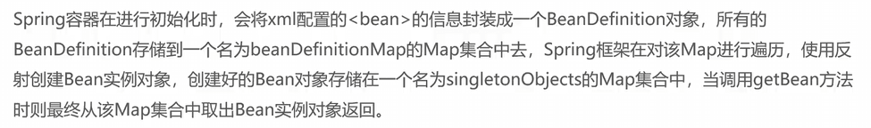

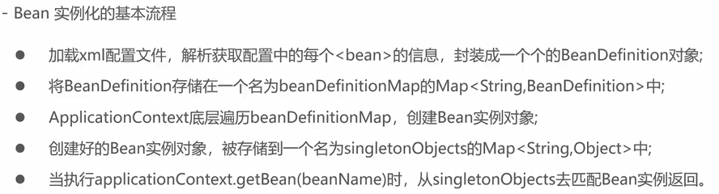


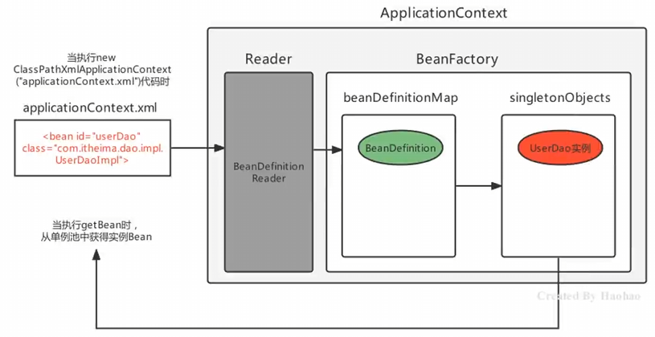


## Spring后处理器

### `BeanFactoryPostProcessor`


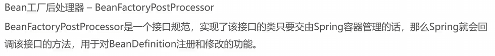


```java 
@FunctionalInterface
public interface BeanFactoryPostProcessor {
    void postProcessBeanFactory(ConfigurableListableBeanFactory var1) throws BeansException;
}
```


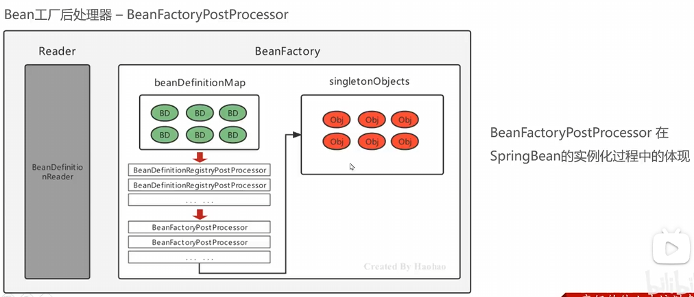


创建 `MyBeanPostProcessor` 类 并实现 `BeanPostProcessor` 接口

```java
public class MyBeanPostProcessor implements BeanPostProcessor {
    @Override
    public Object postProcessBeforeInitialization(Object bean, String beanName) throws BeansException {
        if(bean instanceof UserDaoImpl) {
            UserDaoImpl userDao = (UserDaoImpl) bean;
            userDao.setUserName("hahaha");
        }
        System.out.println(beanName + ": postProcessBeforeInitialization");
        return bean;
    }

    @Override
    public Object postProcessAfterInitialization(Object bean, String beanName) throws BeansException {
        System.out.println(beanName + ": postProcessAfterInitialization"); 
        return bean;
    }
}
```

`UserDao` 接口，数据层接口

```java
public interface UserDao {
        
}

```

数据层实现类

```java
public class UserDaoImpl implements UserDao, InitializingBean {
    
    private String userName;
    
    public void setUserName(String userName) {
        this.userName = userName;
    }
    
    public UserDaoImpl() {
        System.out.println("UserDaoImpl实例化");
    }
   
    public void init() {
        System.out.println("UserDao初始化方法");
    }

    @Override
    public void afterPropertiesSet() throws Exception {
        System.out.println("属性设置之后的方法");
    }
}
```


xml 配置

```java
<bean id="userDao" class="com.kaiming.dao.impl.UserDaoImpl" init-method="init"></bean>
```


程序启动

```java
public class ApplicationContextTest {

    public static void main(String[] args) throws SQLException, IOException {
        ApplicationContext api = new ClassPathXmlApplicationContext("beans.xml");
        Object userDao = api.getBean("userDao");
        System.out.println(userDao);
    }
}
```

输出结果

```java
UserDaoImpl实例化
userDao: postProcessBeforeInitialization
属性设置之后的方法
UserDao初始化方法
userDao: postProcessAfterInitialization
com.kaiming.dao.impl.UserDaoImpl@4d49af10
```


### BeanPostProcessor


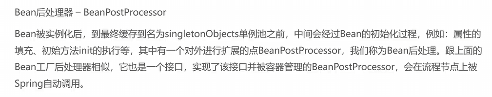


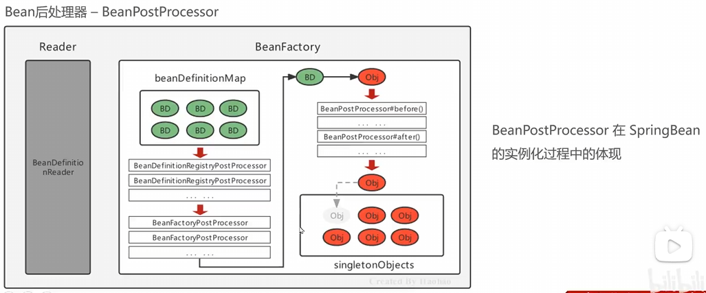


## 容器

### 创建容器

#### 1. 方式一：类路径加载配置文件

```java
ApplicationContext ctx = new ClassPathXmlApplicationContext("applicationContext.xml");
```

#### 2. 方式二：文件路径加载配置文件

```java
ApplicationContext ctx = new FileSystemXmlApplicationContext("D:\\applicationContext.xml");
```

#### 3. 方式三：加载多个配置文件

```java
ApplicationContext ctx = new ClassPathXmlApplicationContext("bean1.xml", "bean2.xml");
```

### 获取bean

```java
ApplicationContext ctx = new ClassPathXmlApplicationContext("beans.xml");
```

#### 1. 方式一：使用bean名称

```java
BookDao bookDao = (BookDao) ctx.getBean("bookDao");
```

#### 2. 方式二：使用bean名称获取并指定类型

```java
BookDao bookDao = ctx.getBean("bookDao", BookDao.class);
```

#### 3. 方式三：使用bean类型获取

```java
BookDao bookDao = ctx.getBean(BookDao.class);
```

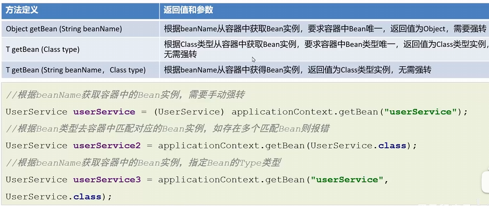

### BeanFactory初始化

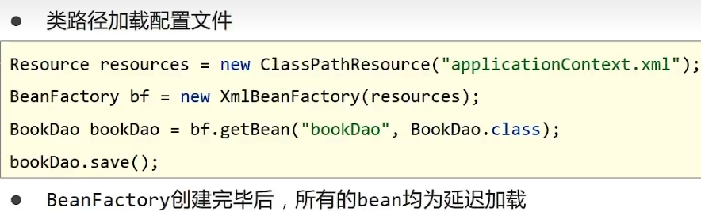


## 核心容器

### 容器相关

> `BeanFactory` 是IoC容器的顶层接口，初始化`BeanFactory`对象时，加载的bean延迟加载；
>
> `ApplicationContext` 接口是Spring容器的核心接口，初始化时bean立即加载；
>
> `ApplicationContext`接口提供基础的bean操作相关方法，通过其他接口扩展其功能；
>
> `ApplicationContext`接口常用初始化类
>
> > `ClassPathXmlApplicationContext`
> >
> > `FileSystemXmlApplicationContext`

### Bean相关

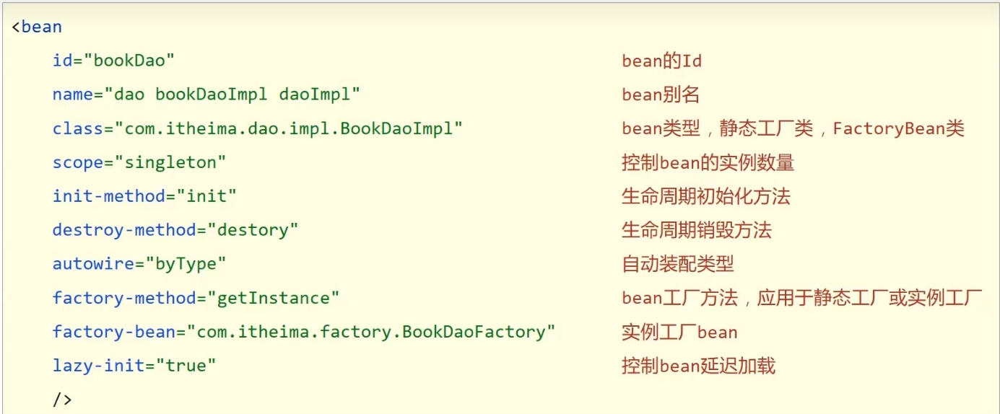

### 依赖注入

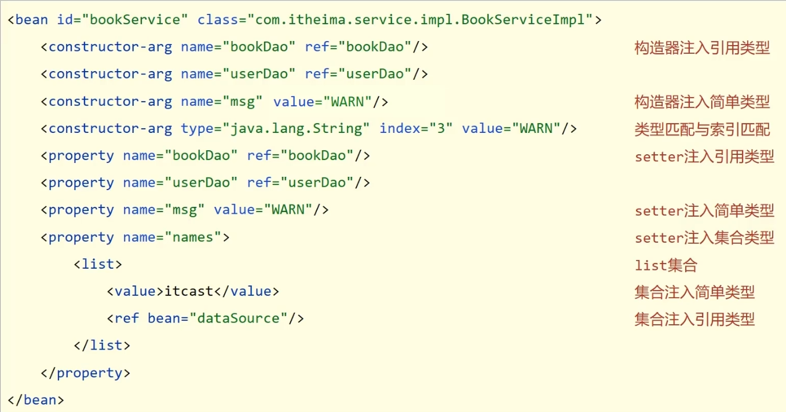


# 注解开发

## 注解开发bean

+ 使用 `@Component` 定义bean

```java
@Component("bookDao")
public class BookDaoImpl implements BookDao{
    
}

@Component
public class BookServiceImpl implements BookService{
    
}
```

+ 核心配置文件中通过组件扫描加载bean

```xml
<context:component-scan base-package="com.itheima"/>
```


Spring提供 `@Component` 注解的三个衍生注解

+ `@Controller` 用户表现层 `bean` 的定义

  + ```java
    @Controller
    public class RestConroller{
        
    }
    ```

+ `@Service` 用户业务层 `bean` 的定义

  + ```java
    @Service
    public class BookServiceImpl implements BookService{
        
    }
    ```

+ `@Repository` 用户数据层 `bean` 的定义

  + ```java
    @Repository
    public class BookDaoImpl implements BookDao{
        
    }
    ```


## 自定义bean常用注解


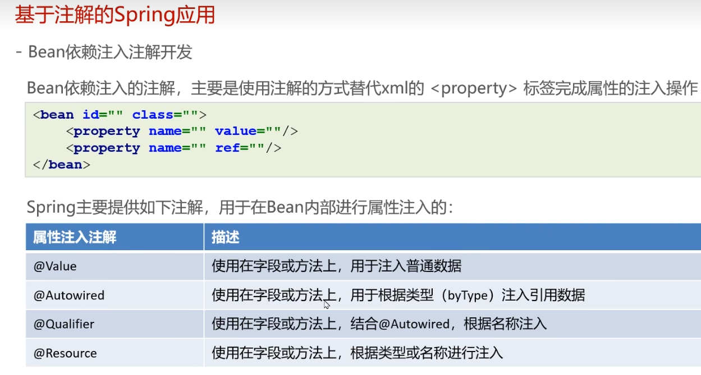


非自定义Bean注解开发

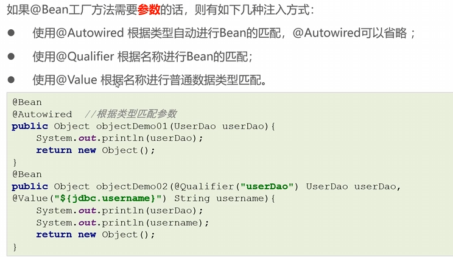


Bean 配置类的注解开发

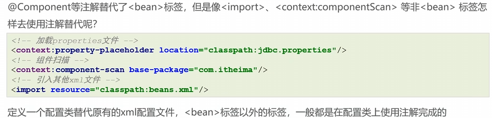


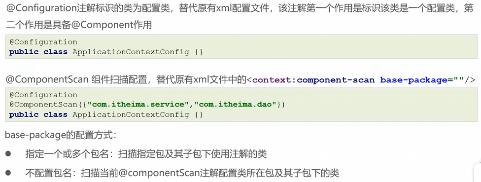


Spring配置其他注解

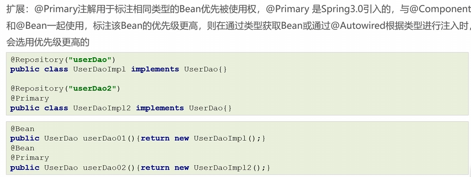


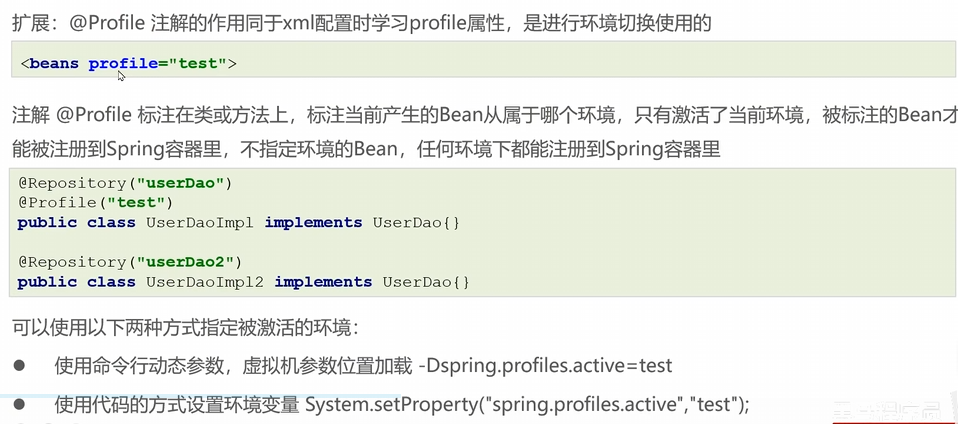


## `@AutoWired` vs `@Resource` 

`@AutoWired` 

+ 根据类型进行注入，如果同一类型的 `bean` 有多个，尝试根据名字进行二次匹配，匹配不成功再报错；
+ 配合 `@Qualifier` 使用，作用是根据 `bean` 的名称注入

 `@Resource`

+ 不指定名称参数时，根据类型注入，指定名称则根据名称注入


## Spring注解原理


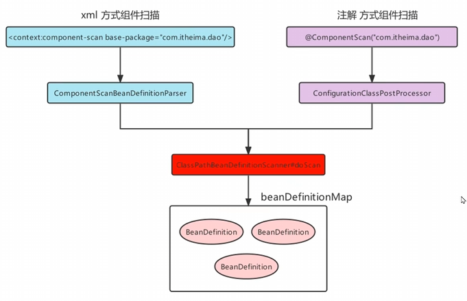

xml方式组件扫描


注解方式组件扫描


## 纯注解开发

+ Spring3.0开启了纯注解开发模式，使用 `java` 类代替配置文件，开启了 `Spring` 快速开发赛道；
+ `Java` 类代替了 `Spring` 核心配置文件；

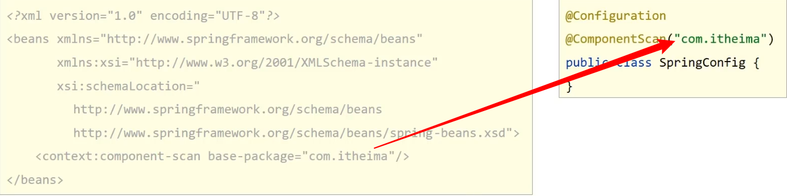

+ `@Configuration` 注解设定当前类为配置类

+ `@ComponentSacn` 注解设定扫描路径，此注解只添加一次，多个数据用数组格式；

  + ```java
    @ComponentScan({"com.itheima.service", "com.itheima.dao"})
    ```


+ `AnnotationConfigApplicationContext` ，容器对象的获取


## bean管理

### 1. 作用范围

使用@Scope定义bean的作用范围

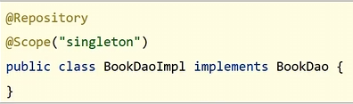

### 2. 生命周期

使用 `@PostConstrut` 和 `@PreDestory` 定义bean的生命周期

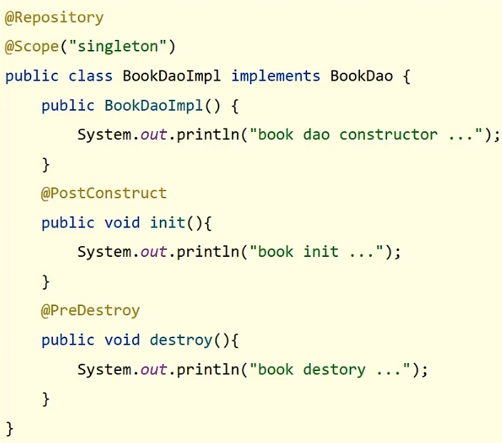


## 依赖注入

### 引用类型

+ 使用 `@Autowired` 注解开启自动装配模式(按类型)

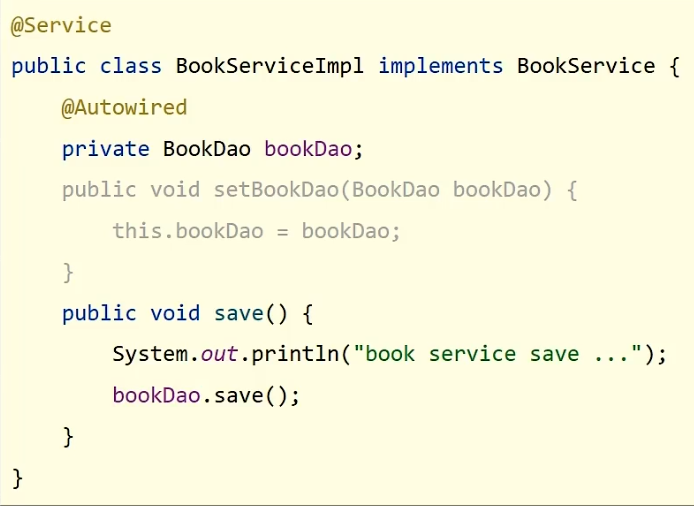

#### 注意

+ 自动装配基于反射设计创建对象并暴力反射对应属性为私有属性初始化数据，因此无需提供setter方法；
+ 自动装配建议使用无参构造方法创建对象(默认)，若不提供对应构造方法，请提供唯一的构造方法。

### 简单类型

使用@Value实现简单类型注入

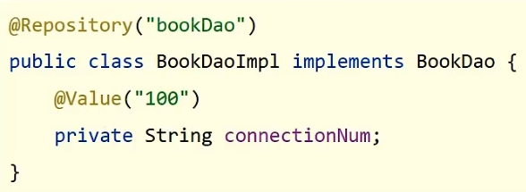

### 加载Properties文件

+ 使用 `@PropertySource` 注解加载 `properties` 文件

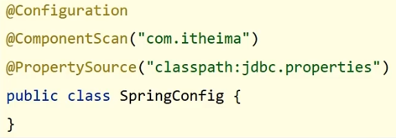

+ **注意**：路径仅支持单一文件配置，多文件使用数组格式配置，不允许使用通配符 `*`

## 第三方bean管理

### @Bean

+ 使用@bean配置第三方bean

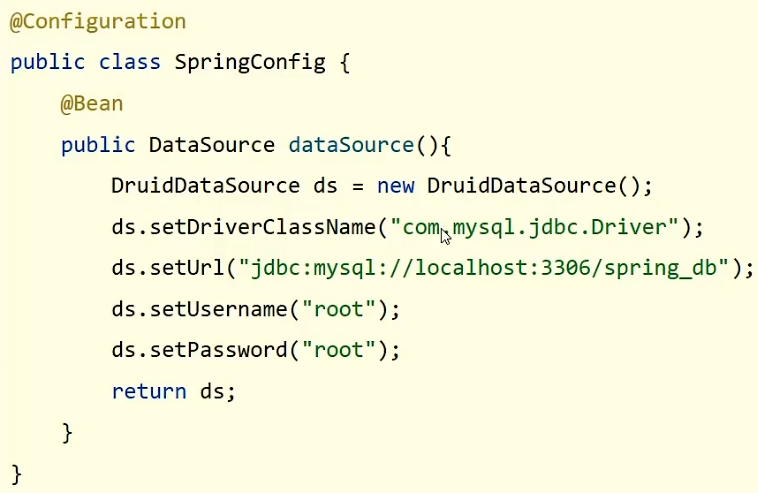

+ 将独立的配置类加入核心配置(因为分开写)
+ 方法一：导入式

```java
public class JdbcConfig{
    
    @Bean
    public DataSource dataSource() {
        DruidDataSource ds = new DruidDataSource();
        // 相关配置
        return ds;
    }
}
```

+ 使用@Import注解手动加入配置类到核心配置， 此注解只加一次，多个数据使用数组格式；

```java

@Configuration
@Import({JdbcConfig.class})
public class SpringConfig {
    
}
```

+ 方式二：使用扫描式

```java
@Configuraton
public class JdbcConfig{
    
    @Bean
    public DataSource dataSource() {
        DruidDataSource ds = new DruidDataSource();
        // 相关配置
        return ds;
    }
}
```

+ 使用 `ComponentScan` 注解扫描配置类所在的包，加载对应的配置类信息

```java
@Configuration
@ComponentScan({"com.itheima.config", "com.itheima.service", "com.itheima.dao"})
public class SpringConfig{
    
}
```

### 第三方依赖注入

#### 引用类型：方法形参

```java
@Bean
public DataSource dataSource(BookService bookService) {
    System.out.println(bookService);
    DruidDataSource ds = new DruidDataSource();
    // 相关配置
    return ds;
}
```

+ 引用类型注入只需要为bean定义方法设置形参即可，容器可根据类型自动装配对象

#### 简单类型：成员变量

+ 简单类型依赖注入


## xml配置与注解配置对比

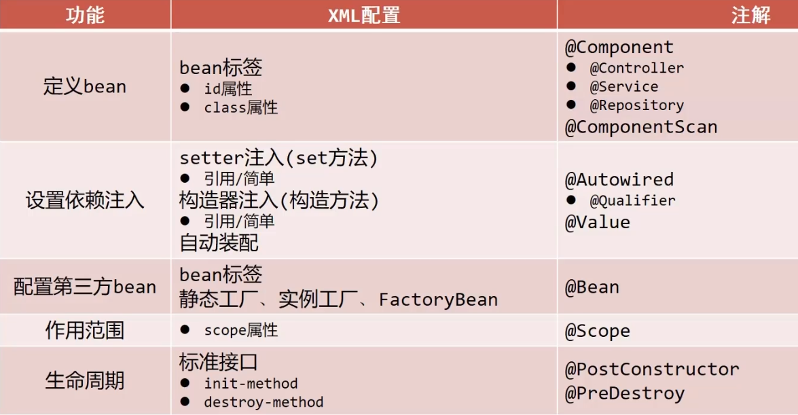


## Spring整合第三方

### Spring整合MyBatis

TODO

### Spring整合Junit

TODO

# AOP

## AOP案例


## AOP工作流程

1. Spring容器启动
2. 读取所有切面配置中的切入点
3. 初始化bean，判定bean对应的类中的方法是否匹配到任意切入点
   + 匹配失败，创建对象
   + 匹配成功，创建原始对象(**目标对象**)的**代理**对象
4. 获取bean执行方法
   + 获取bean，调用方法并执行，完成操作
   + 获取的bean是代理对象时，根据代理对象的运行模式运行原始方法与增强的内容，完成操作

### AOP核心概念

> 目标对象

原始功能去掉共性功能对应的类产生的对象，这种对象时无法直接完成最终工作的

> 代理

目标对象无法直接完成工作，需要对其进行功能回填，通过对原始对象的代理对象实现

### AOP切入点表达式

语法格式

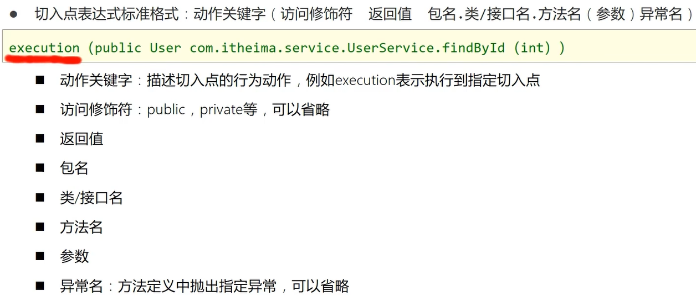

通配符

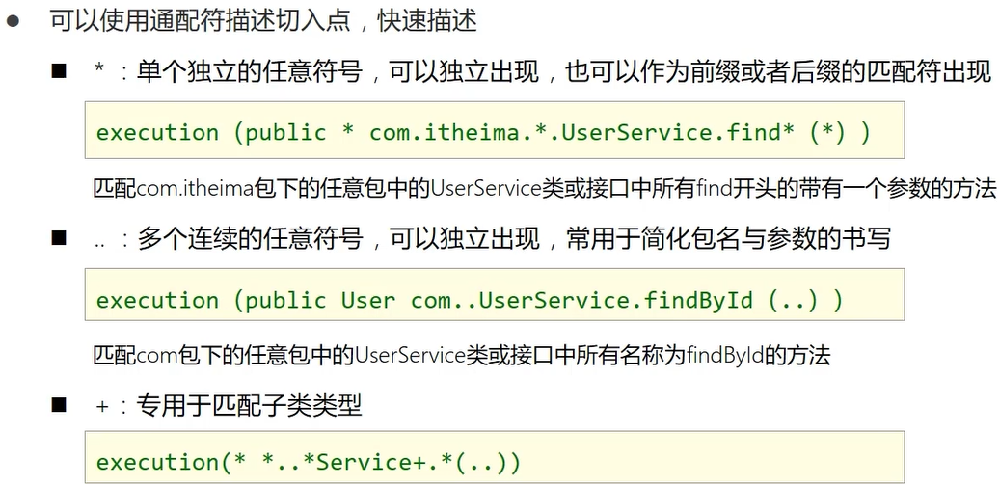

书写技巧

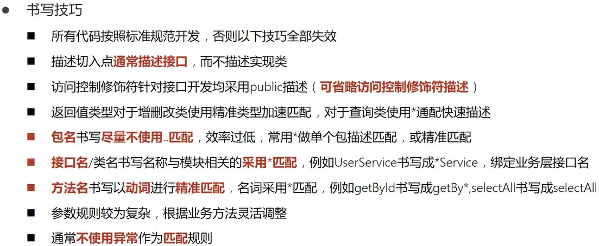


### AOP获取参数

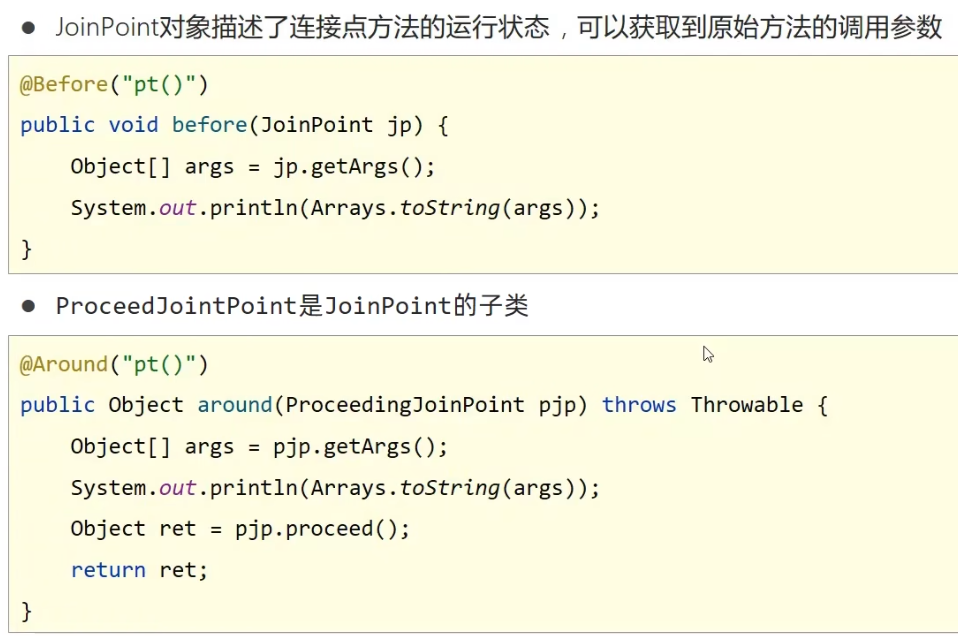


### AOP获取返回值

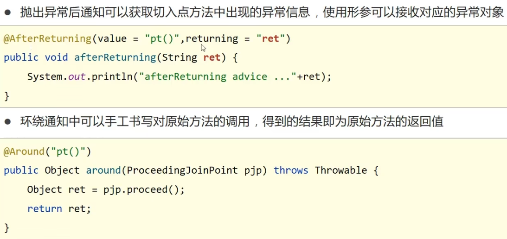

### AOP通知获取异常

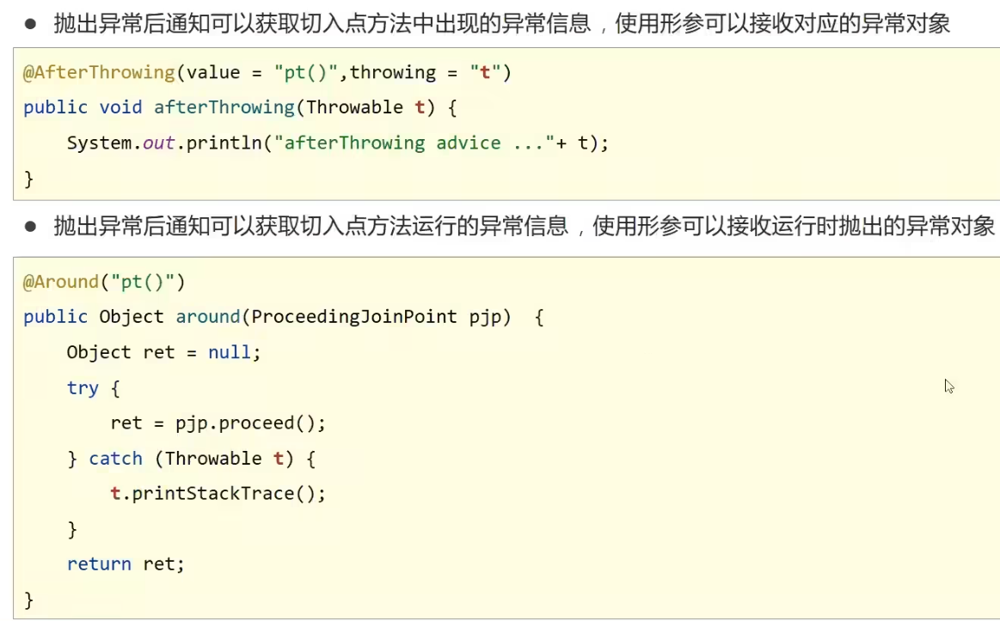


## 实现简单AOP

案例需求：

对 `userServiceImpl` 中的方法做功能增强，通过实现 beanPostProcessor 和 ApplicationContextAware

##### 1. userService接口

```java 
public interface UserService {
    
    public void show1();
    
    public void show2();
}
```

##### 2. userServiceImpl 实现类

```java 
public class UserServiceImpl implements UserService {
    
    @Override
    public void show1() {
        System.out.println("show1...");
    }

    @Override
    public void show2() {
        System.out.println("show2...");
    }
}
```


##### 3. 增强类

```java
public class MyAdvice {
    
    public void before() {
        System.out.println("方法执行前...");
    }
    
    public void after() {
        System.out.println("方法执行后...");
    }
}
```


##### 4. 实现 `BeanPostProcessor` 和 `ApplicationContextAware` 接口

```java
public class MyBeanPostProcessor implements BeanPostProcessor, ApplicationContextAware {

    private ApplicationContext applicationContext;

    @Override
    public Object postProcessAfterInitialization(Object bean, String beanName) throws BeansException {

        if (bean.getClass().getPackage().getName().equals("com.itheima.service.impl")) {
            Object proxyInstance = Proxy.newProxyInstance(
                    bean.getClass().getClassLoader(),
                    bean.getClass().getInterfaces(),
                    (proxy, method, args) -> {
                        MyAdvice myAdvice = applicationContext.getBean(MyAdvice.class);
                        myAdvice.before();
                        Object result = method.invoke(bean);
                        myAdvice.after();
                        return result;
                    }
            );


            return proxyInstance;
        }
        return bean;

    }

    @Override
    public void setApplicationContext(ApplicationContext applicationContext) throws BeansException {
        this.applicationContext = applicationContext;
    }
}
```


##### 5. xml 文件中定义相关 bean 

```java
<?xml version="1.0" encoding="UTF-8"?>
<beans xmlns="http://www.springframework.org/schema/beans"
       xmlns:xsi="http://www.w3.org/2001/XMLSchema-instance"
       xmlns:context="http://www.springframework.org/schema/context"

       xsi:schemaLocation="http://www.springframework.org/schema/beans
       http://www.springframework.org/schema/beans/spring-beans.xsd
        http://www.springframework.org/schema/context
        http://www.springframework.org/schema/context/spring-context.xsd">
    
    <bean id="myBeanPostProcessor" class="com.itheima.processor.MyBeanPostProcessor"></bean>
    
    <bean id="myAdvice" class="com.itheima.advice.MyAdvice"></bean>
    
    <bean id="userService" class="com.itheima.service.impl.UserServiceImpl"></bean>
</beans>
```


#####  6. 调用测试

```java 
public class ApplicationContextTest {
    public static void main(String[] args) {
        ApplicationContext applicationContext = new ClassPathXmlApplicationContext("beans.xml");

        UserService userService = applicationContext.getBean(UserService.class);
        
        userService.show1();
    }
}
```


#### 通过 xml 配置实现 AOP

```java
<?xml version="1.0" encoding="UTF-8"?>
<beans xmlns="http://www.springframework.org/schema/beans"
       xmlns:xsi="http://www.w3.org/2001/XMLSchema-instance"
       xmlns:context="http://www.springframework.org/schema/context"
       xmlns:aop="http://www.springframework.org/schema/aop"

       xsi:schemaLocation="http://www.springframework.org/schema/beans
       http://www.springframework.org/schema/beans/spring-beans.xsd
        http://www.springframework.org/schema/context
        http://www.springframework.org/schema/context/spring-context.xsd
        http://www.springframework.org/schema/aop
        http://www.springframework.org/schema/aop/spring-aop.xsd">

    <bean id="myAdvice" class="com.itheima.advice.MyAdvice"></bean>

    <bean id="userService" class="com.itheima.service.impl.UserServiceImpl"></bean>

    <aop:config>
        <aop:pointcut id="myPointcut" expression="execution(void com.itheima.service.impl.UserServiceImpl.show1())"/>
        <aop:aspect ref="myAdvice">
            <aop:before method="before" pointcut-ref="myPointcut"/>
        </aop:aspect>
    </aop:config>

</beans>
```


#### aspect vs advisor


## AOP总结

+ **概念**：面向切面编程，一种编程范式；
+ 作用：在不经动原始设计的基础上为方法进行功能增强；
+ **核心概念**：
  + 代理(proxy)：Spring AOP的核心本质是采用代理模式实现的；
  + 连接点(JoinPoint)：在Spring AOP中，理解为任意方法的执行；
  + 切入点(PointCut)：匹配连接点的式子，具有共性功能的方法描述；
  + 通知(Advice)：若干个方法的共性功能，在切入点处执行，最终体现为一个方法；
  + 切面(Aspect)：描述通知与切入点的对应关系；(执行位置与共性功能之间的关系)
  + 目标对象(Target)：被代理的原始对象成为代理对象；
+ 切入点表达式标准格式：动作关键字（访问修饰符 返回值 报名.类/接口名.方法名(参数) 异常名）
  + `execution(* com.itheima.service.*Service.*(..))`
+ 切入点表达式描述通配符：
  + 作用：用于快速描述，范围描述；
  + `*` ：表示匹配符号(单个)
  + `..` : 表示匹配多个任意符号(常用)
  + `+` ：匹配子类类型
+ **通知类型**
  + 前置通知(@Before)
  + 后置通知(@After)
  + **环绕通知** (@Around)
    + 环绕通知依赖形参 `ProceedingJoinPoint` 才能实现对原始方法的调用，进而实现原始方法调用前后同时添加通知；
    + 通知中如果位置用 `ProceedingJoinPoint` 对原始方法进行调用将跳过原始方法的执行；
    + 对原始方法的调用可以不接受返回值，通知方法设置成 `void` 即可，如何接受返回值，必须设定为 `Object` 类型；
    + 原始方法的返回值如果时 `void` 类型，通知方法的返回值类型可以设置为 `void` ，也可以设置为 `Object `;
    + 由于无法预知原始方法运行后是否会抛出异常，因此环绕通知方法必须抛出 `Throwable` 对象；
    + 环绕通知可以对原始方法调用过程中出现的异常进行处理
  + 返回后通知 (@AfterReturning)
  + 抛出异常后通知 (@AfterThrowing)
+ 获取切入点方法的参数
  + `JoinPoint` ：适用于前置、后置、返回后、抛出异常后通知，设置为第一个方法的形参参数
  + `ProceedingJoinPoint` ：适用于环绕
+ 获取切入点方法返回值
  + 返回后通知
  + 环绕通知
+ 获取切入点方法运行异常信息
  + 抛出异常后通知
  + 环绕通知


## 基于 xml方式AOP原理


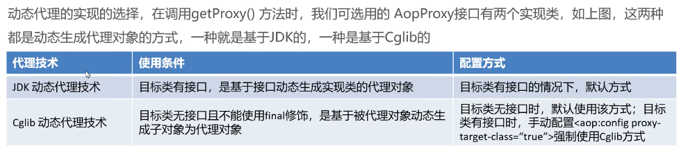


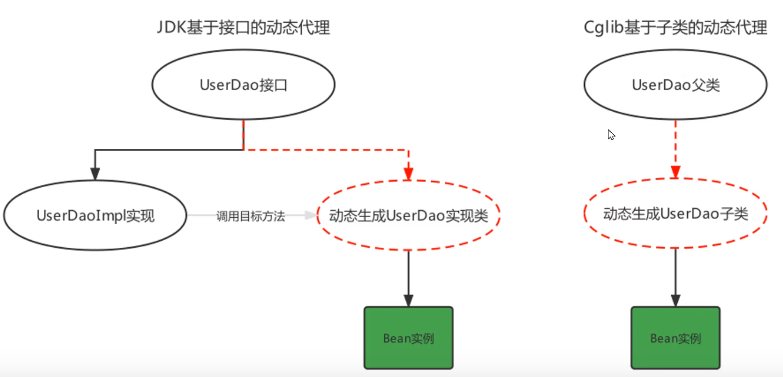


# Spring事务


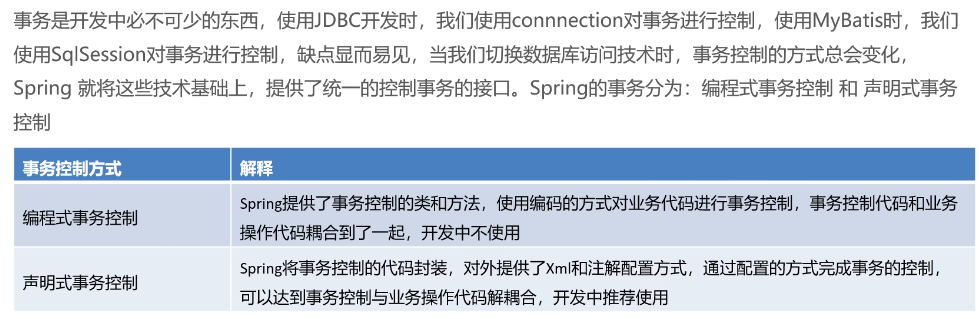


### 事务简介

+ 事务作用：在**数据层**保障一系列的数据库操作同时成功或者同时失败
+ Spring事务作用：在**数据层或业务层**保障一系列的数据库操作同时成功或者同时失败

平台事务管理器

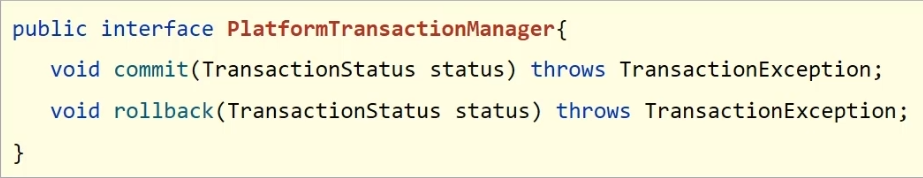

### 事务角色

+ 事务管理员：发起事务方，在Spring中通常指业务层开启事务的方法；
+ 事务协调员：加入事务方，在Spring中通过指数据层方法，也可以指业务层方法

### 事务相关配置

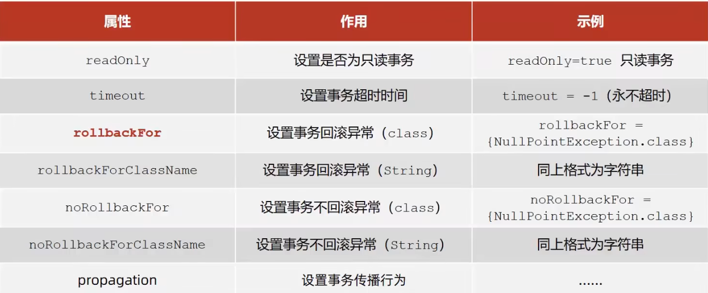

#### 事务传播行为

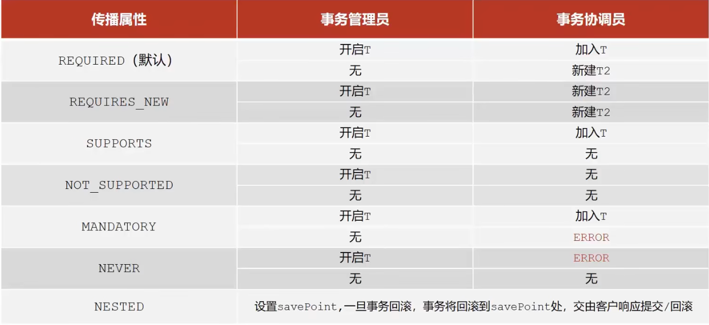


### Spring事务失效

1. 抛出检查异常 (受检异常) 导致事务不能正确回滚
   1. 原因：`Spring` 默认只会回滚非检查异常(非受检异常，也称为运行时异常( `RunTimeException` 以及子类 ))
   2. 解法：配置 `rollbackFor` 属性
2. 业务方法内自己 `try-catch` 异常导致事务不能正确回滚
   1. 原因：事务通知只有捉到了目标抛出的异常，才能进行后续的回滚处理，如果目标自己处理掉异常，事务通知无法知晓
   2. 解法1：异常原样抛出
   3. 解法2：手动设置 `TransactionStatus.setRollbackOnly()` 
3. `aop` 切面顺序导致事务不能正确回滚
   1. 原因：事务切面的优先级最低，但是如果自定义的优先级和它一样，则还是自定义切面在内层。这时若自定义切面未正确抛出异常
   2. 解法：同情况2
4. `@Transaction` 注解需要加在 `public` 的方法上
   1. 原因：spring 为方法创建代理、添加事务通知，前提条件是该方法是 `public`
5. 父子容器导致的事务失效
   1. 原因：子容器扫描范围过大，将未加事务的配置的 service 扫描出来
   2. 解法1： 各扫描个的，不图方便
   3. 解法2：不要使用父子容器，所有bean放在同一个容器

6. 调用本类方法导致传播行为失效
   1. 原因：本类方法调用不经过代理，因此无法增强
   2. 解法1：依赖注入自己代理来调用
   3. 解法2：通过AopContext拿到代理对象，来调用
   4. 解法3：通过CTW，LTW实现功能增强

7. `@Transactional` 没有保证原子行为
   1. 原因：事务的原子性仅涵盖 insert、update、select ... for update 语句，select 方法并不阻塞

8. `@Transactional` 方法导致的 `synchronized` 失效
   1. 原因：`synchronized` 保证的仅是目标方法的原子性，环绕目标方法的还有 `commit`  等操作，它们并未处于 `sync` 块内
   2. 解法1：`synchronized` 范围应扩大到代理方法调用
   3. 解法2：数据库操作，使用 `select ... for update` 替换 `select` 


# SSM(Spring+SpringMVC+Mybatis)整合

[前端控制器-组件原理刨析](https://www.bilibili.com/video/BV1rt4y1u7q5?spm_id_from=333.788.videopod.episodes&vd_source=c566215d81bd03600373a3d8b75d01a6&p=141) 

## javaweb三大组件以及环境特点

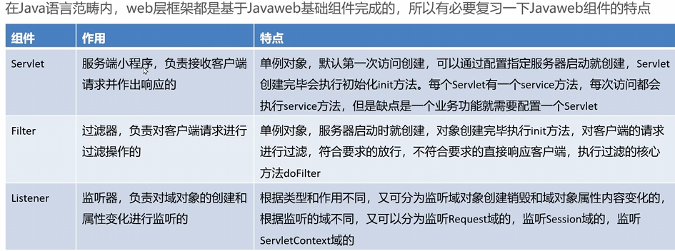


域对象：请求域、会话域、应用域、页面域


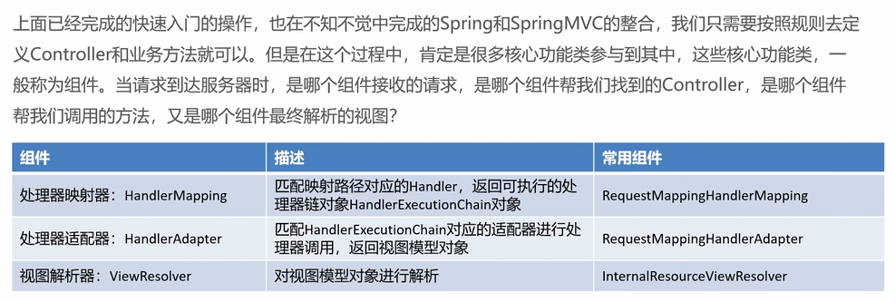


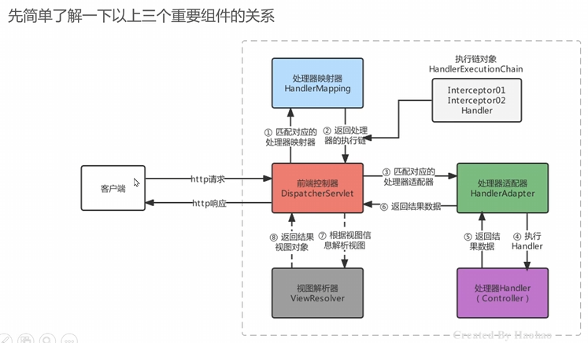

## SpringMVC

#### 概述

+ SpringMVC一种基于Java实现MVC模型的轻量级Web框架
  + 一种表现层框架技术
  + 用于进行表现层功能开发
+ 优点
  + 使用简单，开发便捷（相比较于Servlet）
  + 灵活性强

#### 步骤

1. 导入 `Maven` 坐标

导入 `SpringMVC` 和 `Servlet` 的坐标
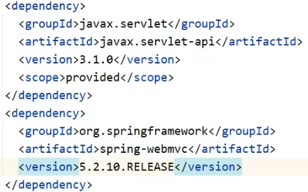

2. 创建SpringMVC控制器类

```java
@Controller
public class UserController{
    
    @RequestMapping("/save")
    @ResponseBody
    public String save() {
        System.out.println("user save...")
        return "{'module': 'springmvc'}";
    }
}
```

3. 初始化SpringMVC环境(同Spring环境)

创建Springmvc的配置文件，加载Controlller对应的bean

```java
@Configuration
@ComponentScan("com.itheima.controller")
public class SpringMvcConfig{
    
}
```

4. 定义一个servlet容器启动的配置类，在里面加载spring的配置

```java
public class ServletContainersInitConfig extends AbstractAnnotationConfigDispatcherServletInitializer {
    // 加载springmvc容器配置
    @Override
    protected WebApplicationContext createServletApplicationContext() {
        AnnotationConfigurationWebApplicationContext ctx = new AnnotationConfigurationWebApplicationContext();
        ctx.register(SpringMvcConfig.class);
        return ctx;
    }

    // 设置哪些请求归属springMVC处理
    @Override
    protected String[] getServletMappings() {
        return new String[]{"/"};
    }

    // 加载spring容器配置
    @Override
    protected WebApplicationContext createRootApplicationContext() {
        return null;
    }
}
```

#### 工作流程

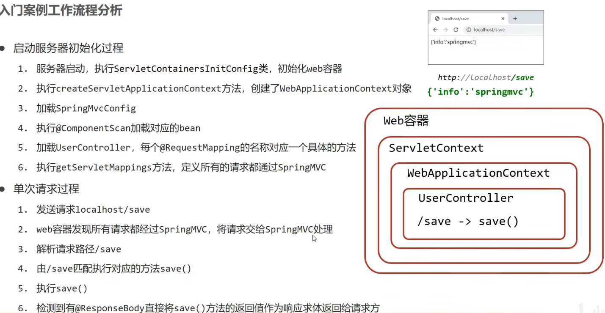


#### 面试

##### [Spring MVC的执行流程](https://www.bilibili.com/video/BV15b4y117RJ?spm_id_from=333.788.videopod.episodes&vd_source=c566215d81bd03600373a3d8b75d01a6&p=160)

初始化阶段：

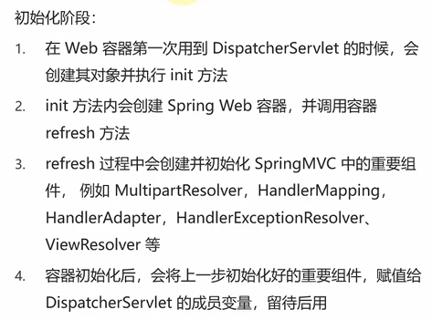


匹配阶段：


执行阶段：

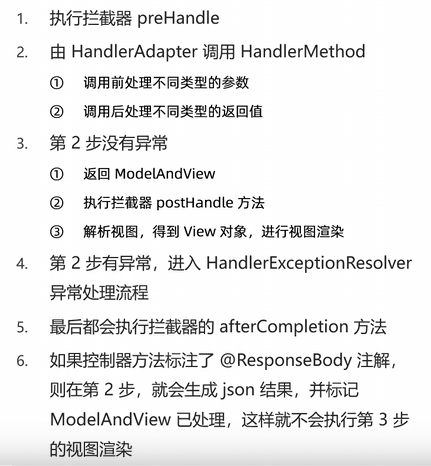


### Controller加载控制与业务bean加载控制

+ SpringMVC相关bean(表现层bean)
+ Spring控制的bean
  + 业务bean (Service)
  + 功能bean (DataSource等)
+ SpringMVC相关bean加载控制
  + SpringMVC相关加载的bean对应的包均在com.itheima.controller包内

+ Spring相关bean的加载
  + 方法一：Spring加载bean设定范围为com.itheima，排除掉controller包内的bean；
  + 方法二：Spring加载bean设定扫描范围为精准范围，例如Service，dao包等；

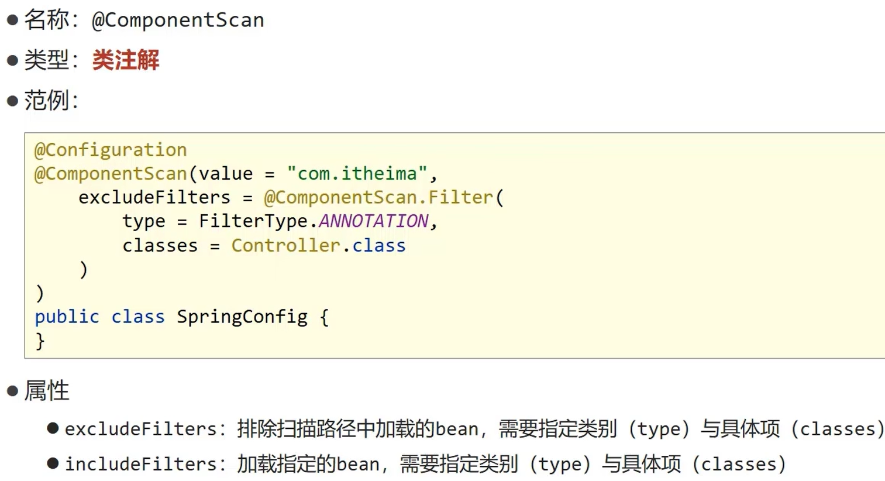

 

### 请求映射路径

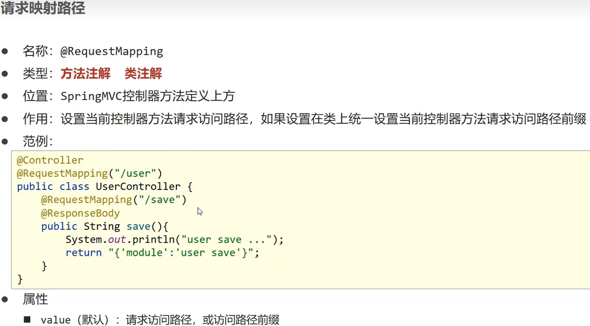

### 请求与响应

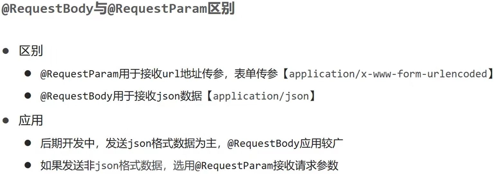

#### 日期类型参数传递

+ 日期类型数据基于系统不同格式也不尽相同
  + 2025-06-10
  + 2025/06/09
  + 06/09/2025
+ 接收形参时，根据不同的日期格式设置不同的接收方式

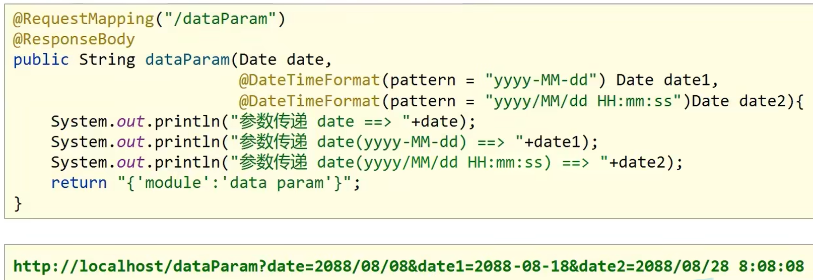

#### DateTimeFormat

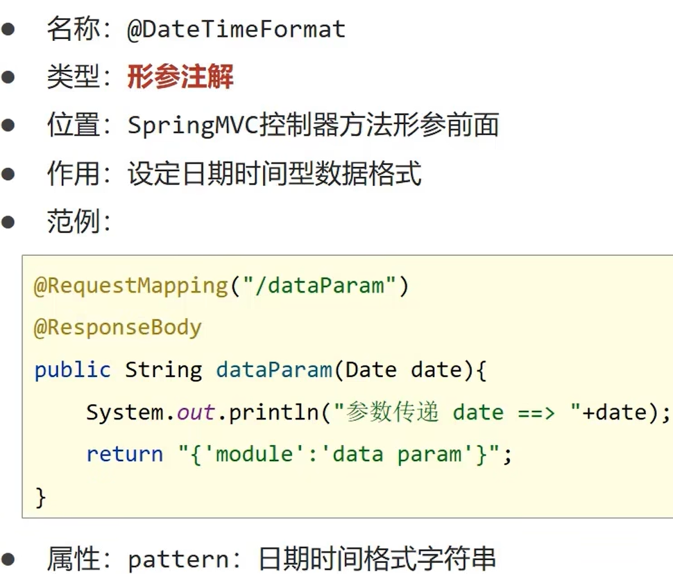

#### 类型转化器

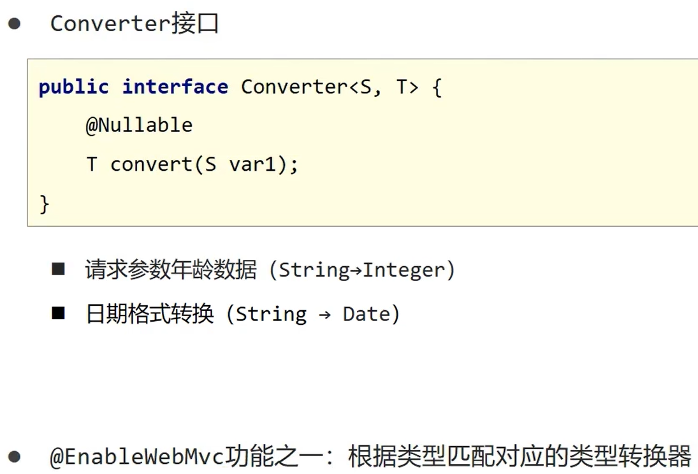

#### 响应

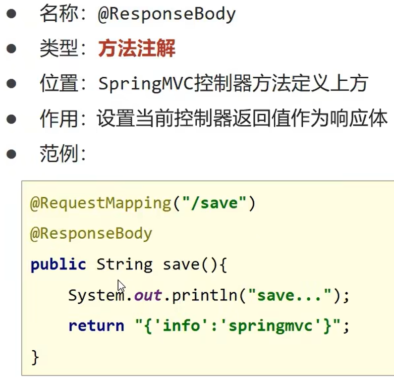

类型转化器 `HttpMessageConverter` 

### Rest风格

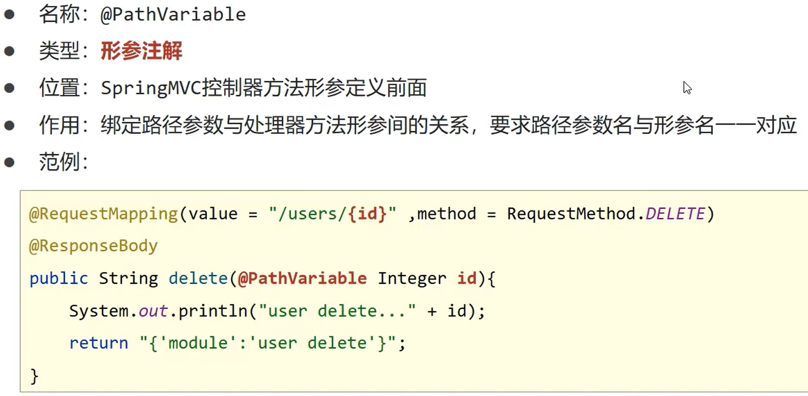

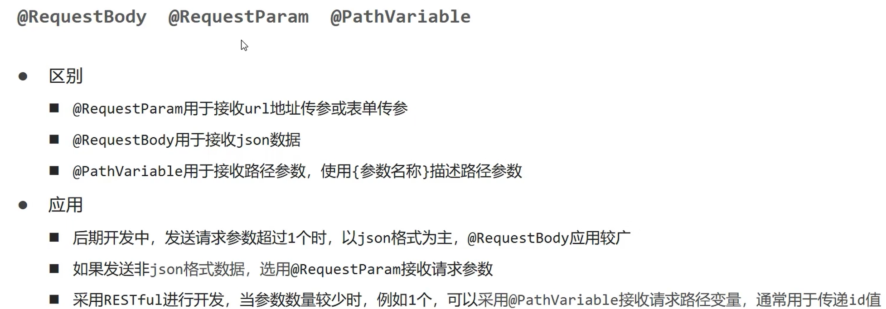

#### 注解开发

`@RestController`

+ 类型：类注解
+ 位置：基于SpringMVC的RESTful开发控制器类定义上方
+ 作用：设置当前控制器类为RESTful风格，等同于 `@Controller` 和 `@ResponseBody` 两个注解组合功能
+ 范例：

```java
@RestController
public class BookController {
    
}
```

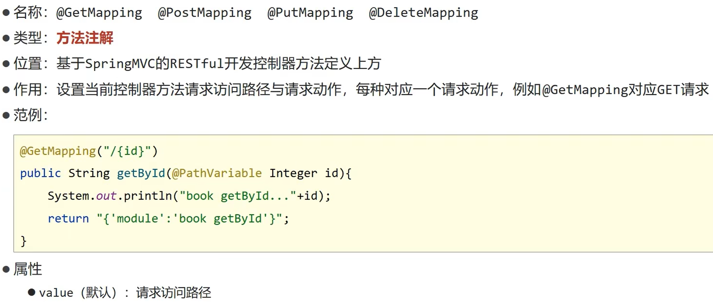

## SSM整合流程

1. 创建工程
2. SSM整合
   1. Spring
      1. SpringConfig
   2. Mybaits
      1. MybatisConfig
      2. JdbcConfig
      3. jdbc.properties
   3. SpringMVC
      1. ServletConfig
      2. SpringMvcConfig
3. 功能模块
   1. 表与实体类
   2. dao（接口与自动代理）
   3. service（接口+实体类）
      1. 业务层接口测试（整合Junit）
   4. controller
      1. 表现层接口测试（Postman）

### 配置类加载(Mybatis与Spring整合)

#### 1. SpringConfig

```java
@Configuration
@ComponentScan({"com.itheima.service"})
@PropertySource("jdbc.properties")
@Import({MybatisConfig.class, JdbcConfig.class})
@EnableTransactionManagement
public class SpringConfig{
    
}
```

#### 2. jdbcConfig

```java

public class JdbcConfig{
    @Value("${jdbc.driver}")
    private String driver;
    @Value("${jdbc.url}")
    private String url;
    @Value("${jdbc.username}")
    private String username;
    @Value("${jdbc.password}")
    private String password;
    @Bean
    public DataSource dataSource() {
    	DruidDataSource dataSource = new DruidDataSource();
        dataSource.setDriveClassName = driver;
        dataSource.setUrl = url;
        dataSource.setUsername = username;
        dataSource.setPassword = password;
        
        return dataSource;
    }
    
    @Bean
    public PlatformTransactionManager transactionManager(DataSource dataSource) {
        DataSourceTransactionManager ds = new DataSourceTransactionManager();
        ds.setDataSource(dataSource);
        return ds;
    }
}
```

#### 3. mybatisConfig

```java

public class MybatisConfig{
    @Bean
    public SqlSessionFactoryBean sqlSessionFactory(DataSource dataSource) {
        SqlSessionFactoryBean factoryBean = new SqlSessionFactoryBean();
        factoryBean.setDataSource(dataSource);
        factoryBean.setTypeAliasesPackage("com.itheima.domain");
        return dataSource;
    }
    
    @Bean
    public MapperScannerConfigurer mapperScannerConfigurer() {
        MapperScannerConfigurer msc = new MapperScannerConfigurer();
        msc.setBasePackage("com.itheima.dao");
        
        return msn;
    }
}
```

#### 4. jdbc.properties的配置文件

```java
jdbc.driver=com.mysql.jdbc.Driver
jdbc.url=jdbc:mysql://localhost:3306/ssm_db
jdbc.username=root
jdbc.password=123456
```

### Spring整和MVC

#### 1. ServletConfig

```JAVA

public class ServletConfig extends AbstractAnnotationConfigDispatchServletInitializer {
    
    protected Class<?>[] getRootConfigClasses() {
        return new Class[]{SpringConfig.class};
    }
    
    protected Class<?>[] getServletConfigClasses() {
        return new Class[]{SpringMvcConfig.class};
    }
    
    protected Class<?>[] getServletMappings() {
        return new String[]{"/"};
    }
    
    // 过滤器
    @Override
    protected Filter[] getServletFilter() {
        CharacterEncodingFilter filter = new CharacterEncodingFilter();
        filter.setEncoding("UTF-8");
        return new Filter[]{filter};
    }
}
```


#### 2. SpringMvcConfig

```java
@Configuration
@ComponentScanner("com.itheima.controller")
@EnableWebMvc
public class SpringMvcConfig{
    
    
}
```

### 模块

#### 1. domain

```java
public class Book{
    
    private Integer id;
    private String type;
    private String name;
    private String description;
    
    @Override
    public String toString() {
        return "Book{" +
            "id" + id + 
            ", type = " + type + '\' + 
            ", name = " + name + '\' + 
            ", description = " + description + '\' + 
            '}';
    }
    
    // set 和 get方法
}
```


#### 2. dao

```java
public interface BookDao {
    @Insert("insert into tbl_book values(#{type}, #{name}, #{description})")
    public void save(Book book) ;
    @Update("update tbl_book set type=#{type}, name=#{name}, description=#{description}")
    public void update(Book book);
    @Delete("delete from tbl_book where id = #{id}")
    public void delete(Integer id);
    @Select("select * from tbl_book where id = #{id}")
    public Book getById(Integer id);
    @Select("selcet * from tbl_book")
    public List<Book> getAll();
}
```


#### 3. service

##### 接口

```java
@Transactional
public interface BookService {
    
    public boolean save(Book book);
   
    public boolean update(Book book);
   
    public boolean delete(Integer id);
    
    public Book getById(Integer id);

    public List<Book> getAll();
}
```

##### 实现类

```java
@Service
public class BookServiceImpl implements BookService{
    @Resource;
   	private BookDao bookDao;
    
    public boolean save(Book book) {
        bookDao.save(book);
        return true;
    }
   
    public boolean update(Book book) {
        bookDao.update(book);
        return true;
    }
   
    public boolean delete(Integer id) {
        bookDao.delete(id);
        return true;
    }
    
    public Book getById(Integer id) {
        return bookDao.getById(id);
    }

    public List<Book> getAll() {
        return bookDao.getAll();
    }
}
```


#### 4. controller

```java
@RestController
@RequestMapping("/books")
public class BookController {
    
    @AutoWired
    private BookService bookService;
    
    @PostMapping("/save")
    public boolean save(@RequestBody Book book) {
       	return bookService.save(book); 
    }
   	@PutMapping("/update")
    public boolean update(@RequestBody Book book) {
        return bookService.update(book); 
    }
   	@DeleteMapping("/delete/{id}")
    public boolean delete(@PathVarable Integer id) {
        return bookService.delete(book); 
    }
    @GetMapping("{id}")
    public Book getById(@PathVarable Integer id) {
        return bookService.getById(id);
    }
	@GetMapping
    public List<Book> getAll() {
        return bookService.getAll();
    }
}
```

### 事务

1. 开启事务注解驱动
2. 添加平台事务管理器
3. service接口添加 `@Transactional` 注解


## 异常处理器

### 异常

springMVC异常处理流程

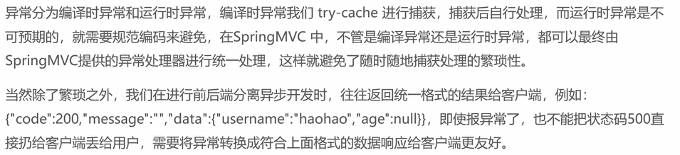


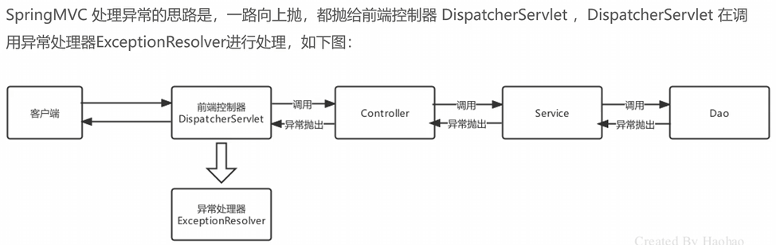


> 集中、同一处理项目中的异常

```java
@RestControllerAdvice
public class ProjectExceptionAdvice{
    @ExceptionHandler(Exception.class)
    public Result doException(Exception ex) {
        return new Result(666, null);
    }
}
```


### 常见位置和原因

+ 出现异常现象的常见位置与常见原因：
  + 框架内部抛出异常：因使用不合规导致
  + 数据层抛出异常：因外部服务器故障导致(例如：服务器访问超时)
  + 业务层抛出异常：因业务逻辑书写错误导致（例如：遍历业务书写操作，导致索引异常）
  + 表现层抛出异常：因数据收集、校验等规则导致（例如：不匹配的数据类型导致异常）
  + 工具类抛出异常：因工具类书写不严谨不够健壮导致(例如：必要释放的连接长期未释放)

### 解决方法

基于AOP开发

+ 集中统一处理项目中出现的异常

```java
@RestControllerAdvice
public class ProjectExceptionAdvice{
    
    @ExceptionHandler
    public Result doException(Exception ex) {
        
        return new Result(666, null);
    }
}
```


#### 注解

> @RestControllerAdvice

类型：类注解

位置：Rest风格开发的控制器增强类定义上方

作用：为Rest风格开发的控制器类做增强

说明：此注解自带 `@ResponseBody` 注解和 `@Component` 注解，具备对应功能

> @ExceptionHandler

类型：类注解

位置：专用于异常处理的控制器方法的上方

> 作用：设置指定异常的处理方案，**功能上等同于控制器方法，出现异常后终止原控制器执行，并转入当前方法执行**；

说明：此类方法可以根据处理的异常不同，制作多个方法分别处理对应的异常

### 项目异常处理方法

#### 项目异常分类

+ 业务异常
  + 规范用户行为产生的异常
  + 不规范用户行为产生的异常

+ 系统异常
  + 项目运行过程中可预计且无法避免的异常
+ 其他异常
  + 编程人员未预期到的异常

#### 项目异常处理方案

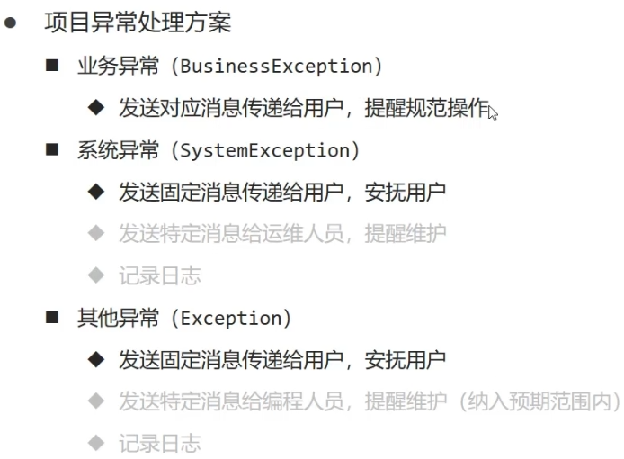

#### 项目异常处理操作

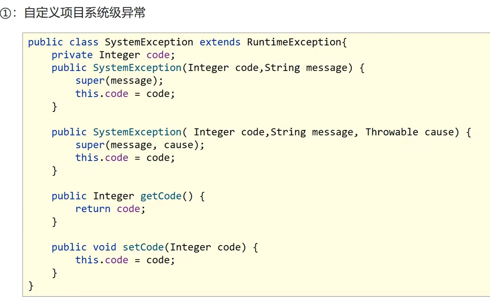

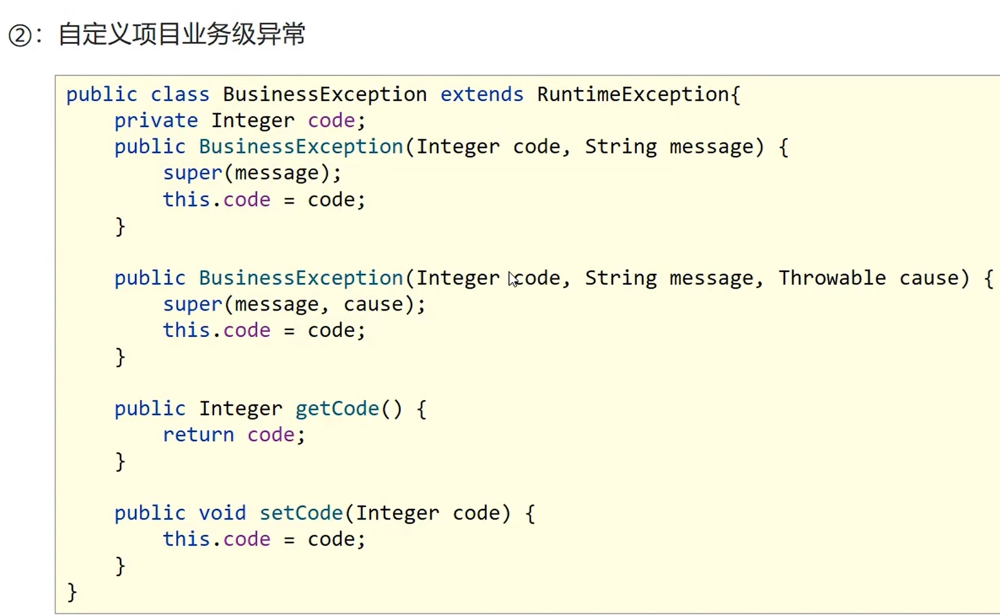

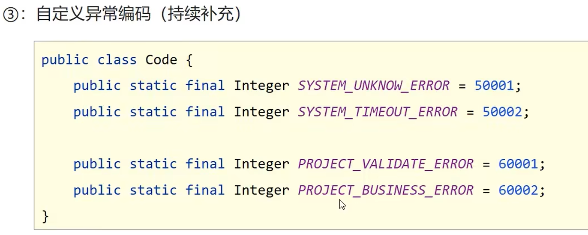

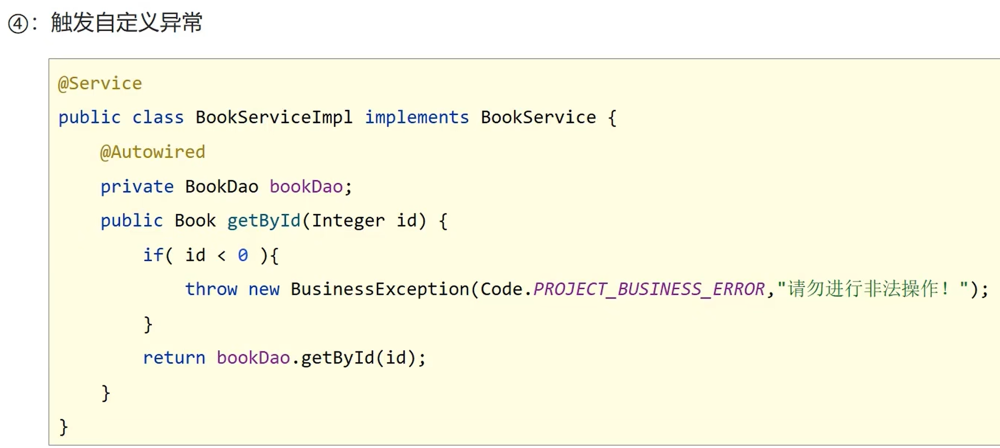


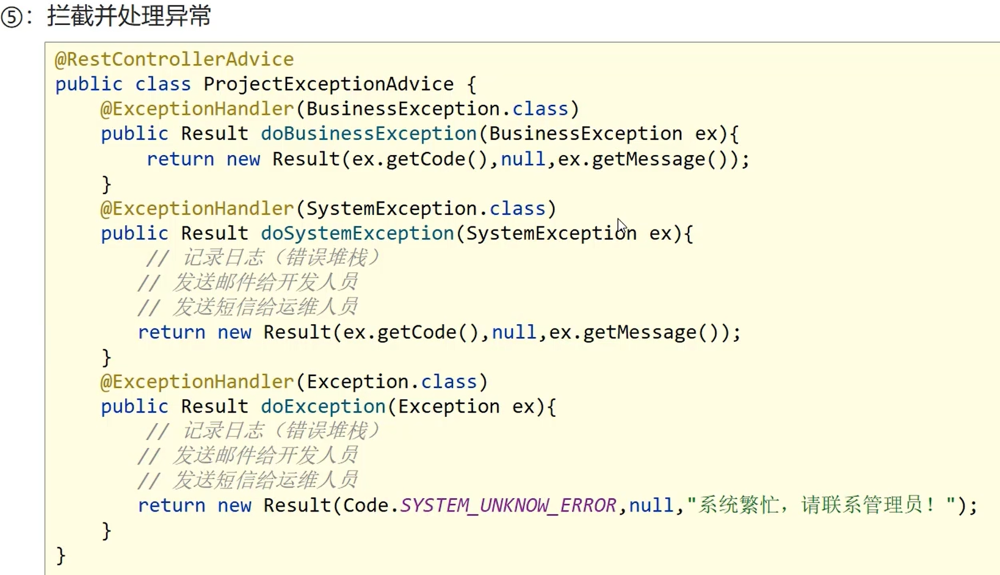


## 拦截器

概念：一种动态拦截方法调用的机制，在SpringMVC中动态拦截控制器方法的执行

作用：

+ 在指定方法的前后执行预先设定的代码
+ 阻止原始方法的执行

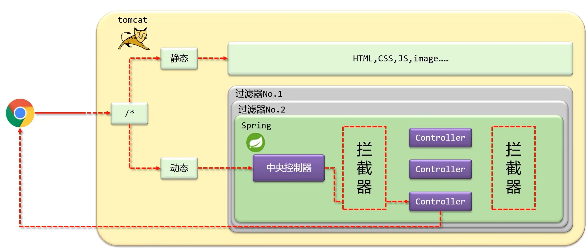


### 拦截器与过滤器的区别

+ 归属不同：Filter属于Servlet技术，Interceptor属于SpringMVC技术
+ 拦截内容不同：Filter对所有访问进行增强，Interceptor仅对SpringMVC的访问进行增强

### 入门案例

1. 制作拦截器功能类
2. 配置拦截器的执行位置

第一步

声明拦截器的bean，并实现 `HandlerInterceptor` 接口

```java
@Bean
public class ProjectInterceptor Implements HandlerInterceptor{
    
    public boolean preHandler(..) throws Exception{
        System.out.println("preHandler...");
        return true;
    }
    
    public void postHanlder() {
        System.out.println("postHandler...");
    }
    
    public void afterCompletion() throws Exception {
        System.out.println("afterCompletion...");
    }
}
```

第二步

定义配置类，继承 `WebMvcConfigurationSupport` ，实现 `addInterceptor` 方法

```java

@Configuration
public class SpringMvcSupport implements WebMvcConfigurationSupport{
    
    @Override
    public void addInterceptor(InteceptorRegistry registry) {
        ...
    }
}
```

第三步

添加拦截器并设定拦截的访问路径，路径可以设置多个可变参数

```java

@Configuration
public class SpringMvcSupport implements WebMvcConfigurationSupport{
    
    private ProjectInterceptor projectInterceptor;
    
    @Override
    public void addInterceptor(InteceptorRegistry registry) {
        registry.addInterceptor(projectInterceptor).addPathPattern("/books");
    }
}
```

第四步，使用标准接口 `WebMvcConfigure` 简化开发(注意：侵入式较强)

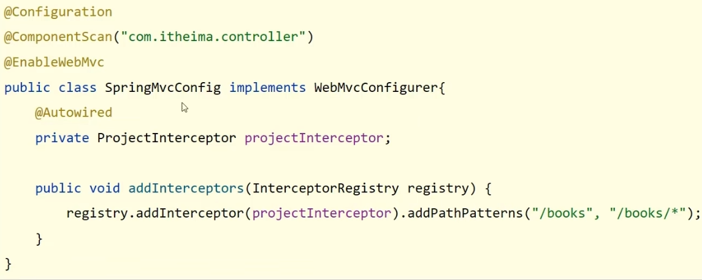

### 拦截器参数

#### 前置处理

```java
public boolean preHandler(HttpServletRequest request, HttpServletResponse response, Object handler) throws Exception {
    System.out.println("preHanlder...");
    return true;
}
```

+ 参数
  + request : 请求对象
  + response：响应对象
  + handler：被调用的处理器对象，本质是一个方法对象，对反射技术中的Method对象进行了再包装
+ 返回值
  + 返回false，被拦截的处理器不被执行

#### 后置处理

```java
public boolean postHandler(HttpServletRequest request, 
                           HttpServletResponse response, 
                           Object handler,
                          MethodAndView modelAndView) throws Exception {
    System.out.println("postHanlder...");
}
```

+ 参数
  + ModelAndView：如果处理器执行完具有返回结果，可以读取到对应数据与页面信息，并进行调整

### 拦截器链

#### 拦截器链的配置方法


#### 拦截器链的执行顺序

+ preHandler：与配置顺序相同，必定执行
+ postHandler：与配置顺序相同，可能不执行
+ afterCompletion：与配置顺序相同，可能不执行


+ 当配置多个拦截器时，形成拦截器链；
+ 拦截器链的运行顺序参照拦截器添加顺序为准；
+ 当拦截器中出现对原始处理器的拦截，后面的拦截器均终止执行；
+ 当拦截器运行中断，仅运行配置在前面的拦截器的 `afterCompletion` 操作；


# SpringBoot

`SpringBootApplication`

`SpringBootConfiguration` 、`EnableAutoConfiguration` 、`ComponentScan` 

+ SpringBoot目的用来简化Spring应用的初始搭建以及开发过程

+ Spring程序缺点
  + 配置繁琐
  + 依赖设置繁琐
+ SpringBoot优点
  + 自动配置
  + 起步依赖
  + 辅助功能(内置服务器, ...)


### 启动流程

创建 `SpringApplication` 对象

1. 记录 `BeanDefinition` 源
2. 推断应用类型
3. 记录 `ApplicationContext` 初始化器
4. 记录监听器
5. 推断主启动类

执行 `run` 方法

1. 得到 `SpringApplicationRunListeners` ，事件发布器
   + 发布 `application starting` 事件
2. 

### 基础配置

1. yaml数据格式
   + .yml(主流)
   + .yaml
2. 读取方式

> 使用 `@Value` 读取单个数据，属性名引用方式：${一级属性名.二级属性名}

> 封装全部数据到对象

> 自定义对象封装指定数据

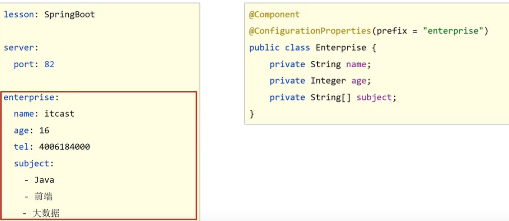


###  DML控制


#### 乐观锁

+ 业务并发现象带来的问题：秒杀

第一步

数据库中添加标记字段

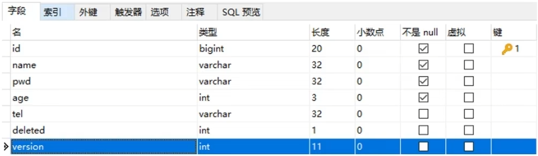

第二步

实体类中添加对应字段，并设置当前字段为逻辑删除标记字段

```java
public class User{
    
    private Long id;
    
    @Version
    private int version;
}
```

第三步

配置乐观锁拦截器实现锁机制对应的动态SQL语句拼装

```java
@Configuration
public class MpConfig{
    public MyBatisPlusInterceptor mpInterceptor() {
        @Bean
        MyBatisPlusInterceptor mpInterceptor = new MyBatisPlusInterceptor();
        mpInterceptor.addInterceptor(new OptimisticLockerInnerInterceptor());
        return mpInterceptor;
    }
}
```

第四步

使用乐观锁机制再修改前必须先获取到对应数据的 `version` 方可执行

```java
@Test
void update() {
    // 查询数据，获取version数据
    User user = userDao.seletById(1L);
    // 修改数据操作
    user.setName("Tom and Jerry");
    userDao.updateById(1L);
}
```

### 代码生成器

导入maven坐标

```java
<!-- https://mvnrepository.com/artifact/com.baomidou/mybatis-plus-generator -->
<dependency>
    <groupId>com.baomidou</groupId>
    <artifactId>mybatis-plus-generator</artifactId>
    <version>3.4.1</version>
</dependency>
<!-- https://mvnrepository.com/artifact/org.apache.velocity/velocity-engine-core -->
<dependency>
    <groupId>org.apache.velocity</groupId>
    <artifactId>velocity-engine-core</artifactId>
    <version>2.3</version>
</dependency>
```

```java
// 创建生成器坐标，执行生成代码操作
AutoGenerator generator = new AutoGenerator();
generator.execute();
```

数据源指定

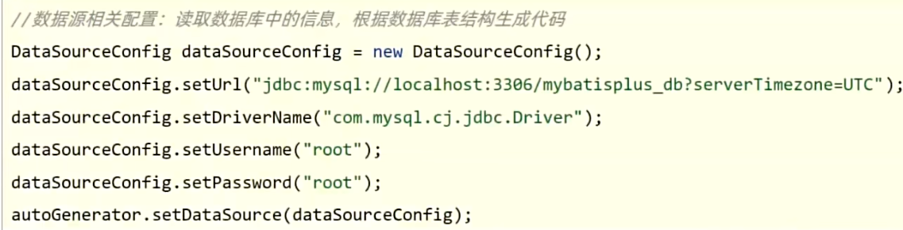

全局配置

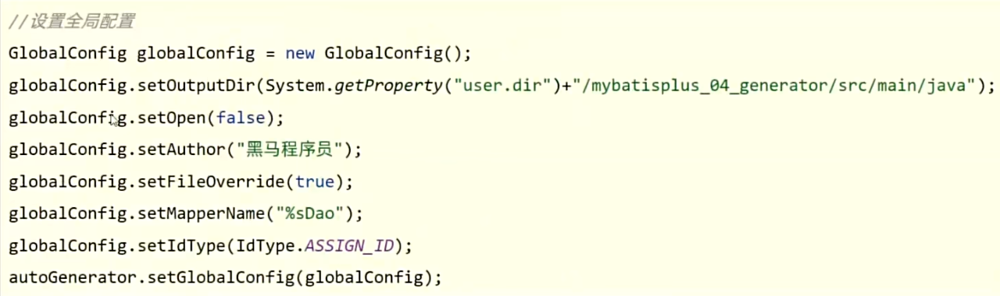

包相关配置

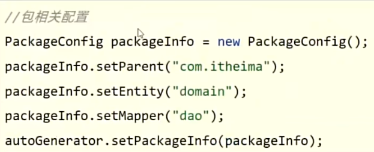

策略配置

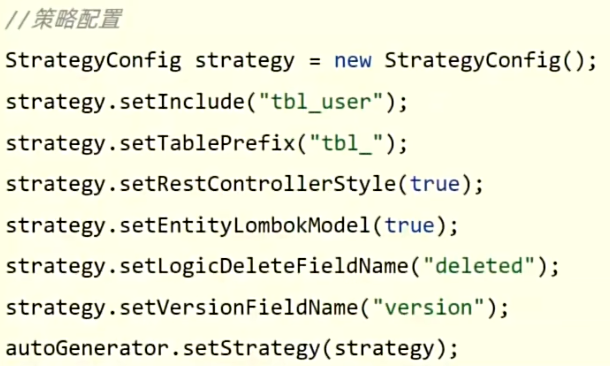
